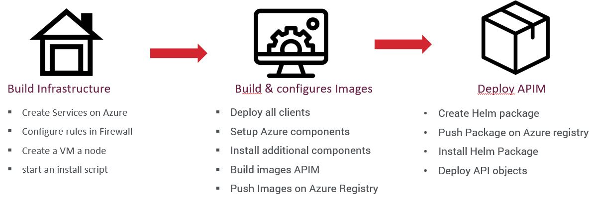
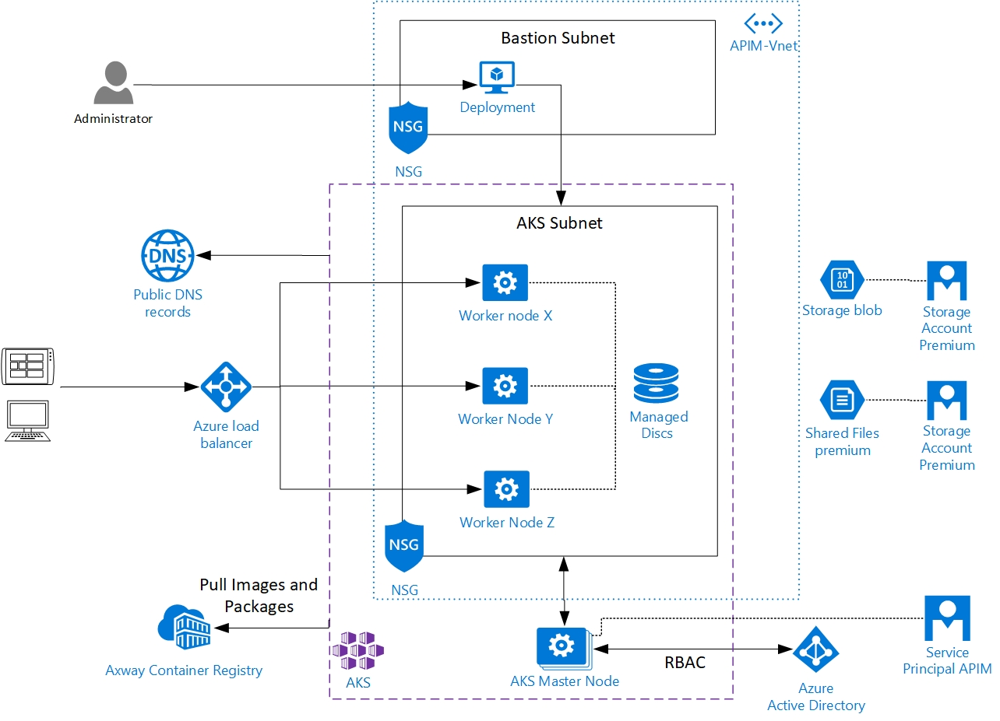

# Axway AMPLIFY API Management on Azure

API management is the process of building secure APIs, publishing them for reusability, and deploying them in a scalable environment. **AMPLIFY API Management** lets you create APIs from cloud and on-premise services, publish them to a marketplace, and enable self-service consumption while controlling access and use. Embedded analytics provides the right measuring tools to ensure your digital success and the API gateway sits in front of APIs acting as a protector, enforcing security and ensuring scalability and high availability.

This deployment contains **all assets to create a first generic deployment inside your Azure subscription**. It uses only PaaS Azure services and **CNCF technologies** and the most important **Azure Kubernetes Services**.

After the deployment, you will be able to set your specific context by adapting ARM templates and helmchart for custom deployment. Keep in mind that this architecture is a Demo and couldn't be used in production. Please read recommendation and best-practice on the [container documentation](https://github.com/Axway/axway-open-docs/blob/master/content/en/docs/apim_installation/apigw_containers/container_intro.md).

Techlabs are available on github [here](https://github.com/Axway/Cloud-Automation/APIM/Techlabs).

Deployment is done in three main steps.

1. Prerequisite and deployment only by ARM template. Last action is to start the customs script extension object to execute bash script.
2. The bash script used to configure the VM and all Azure services and deploy additionnal components as Nginx or certbot manager for certificates.This step creates all AMPLIFY APIM component docker images.
3. Action to deploy AMPLIFY API Management on Azure Kubernetes.

## Architecture
Here is the architecture deployed with this script.More deployment option will be available soon (see Limitation section).

Please read the Azure reference architecture for more informations. *TODO : Add link to this document*

## Dependencies
This ressource is available only for version **7.6.2-SP4** and **7.7-SP1** available on Axway website. Also new APIM version will be tested in time.

It uses Cassandra v2.2.6 for persistant database.

Although Axway AMPLIFY API Management is supported with other RBDMS, the script can only deploy a Mysql server. 

The deployment is based on a **Kubernetes version 1.15.5**, that is in preview on Azure Kubernetes Services.

## Prerequisites
For prerequisite, you must have enough permission on your subscription to create a service principal on services:
- DNS Zone contributor (only if you set to true manage DNS parameter)
- Owner on the target resource group deployment.
Please follow this [link](https://github.com/MicrosoftDocs/azure-docs/blob/master/articles/aks/kubernetes-service-principal.md) to configure one.

Then create a Blob storage account in the target region with 3 containers :
1. products : upload application package APIGateway, APIPortal and docker scripts. Go to Axway's support website [download page](https://download.axway.com).
2. dependencies : Upload the mysql jar library.
3. data : Upload your Docker license key file and a fed with your configuration.
4. helmcharts : Copy the helmchart source available [here](https://github.com/Axway/Cloud-Automation/APIM/Helmcharts) 

## Deployment
Somes parameters change the deployment. Here is a resume:
- *apimVersion*. It will be used to search package and name package. Value autorized 7.6.2 and 7.7
- *projectName* and *environment* are used for naming.
- *userAdmin* and *_adminPassword* set the user on the bastion VM.
- *email* used for let's encrypt registration.
- *sourceBlobStorageName* is the blob where stored assets.
- *portal* set true to deploy API-Portal component.
- *webhookUrl* Streams log on Microsoft Teams.
- *servicePrincipalName*, *_servicePrincipalID*, *_servicePrincipalSecret* to the prefconfigured SP.
- *_tenantID*

After the deployment, the VM can be used to manage the cluster. Access in ssh is granted. (please definir an **IP restriction** for more security).
Two opportunities to deploy the solution.

### Azure Portal : Deploy without changes

### Powershell scripts : Developer mode
This method is usefull to pimp ARM template and bash script for your case.
1. Clone this repository on your device.
2. Set variables in GetAppConfig.ps1 with your prefered text editor.
3. Open a Windows Powershell
4. Connect to Azure with Connect-AzAccount cmdlet.
5. Execute DeployAxwayAPIMTemplate.ps1

This script enable Debug and you can see all

## Limitations
This quickstart doesn't deploy Axway components (for the moment):
* Oauth component
* API Gateway Analytics
* Embedded Analytics
* API Builder
* Backend examples (share your needs)

Password for Mysql database are set automatically. It's possible to view values inside Kubernetes secrets. 

Optional components are missing : 
* Cassandra cluster on VM
* Azure monitoring with prometheus
* Azure Application Gateway
* Azure Database for Mysql

## Contribute & Debug 
All new capabilities will be usefull for the community. So don't hesitate to add optional component or configuration.

The bash script is executed by a custom script extension in folder 
*/var/lib/waagent/custom-script/download/0*
You can find also some log files stdout and stderror.
A **Webhook MS teams** could be configured to receive all logs and defined error.

Join the Cloud & automation community on [Axway website](https://community.axway.com/). And be sure to share your problem or idea.