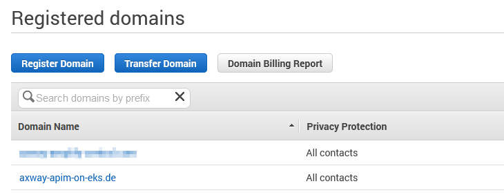
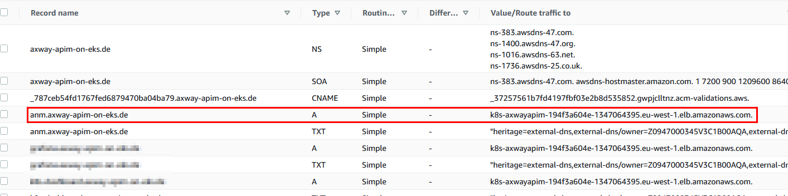
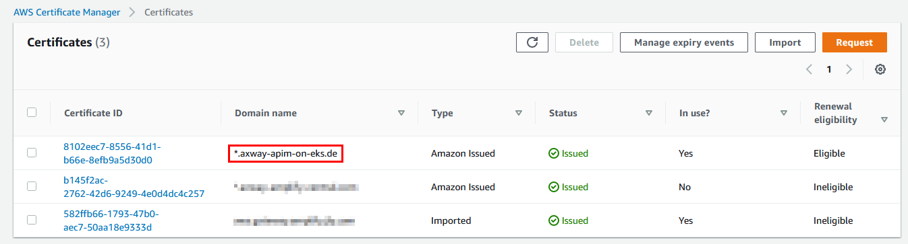
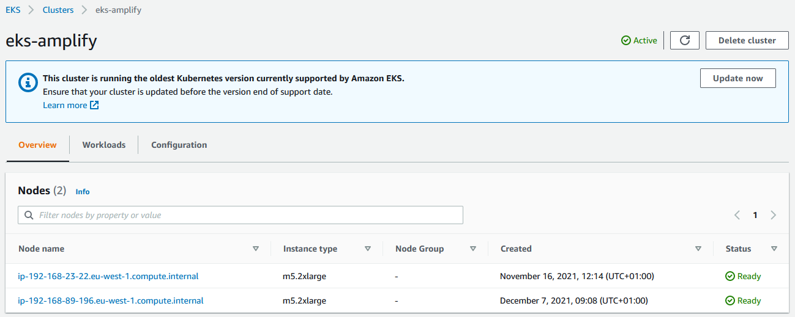
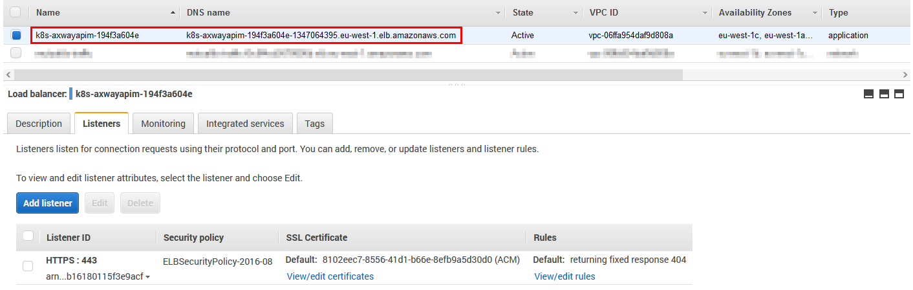
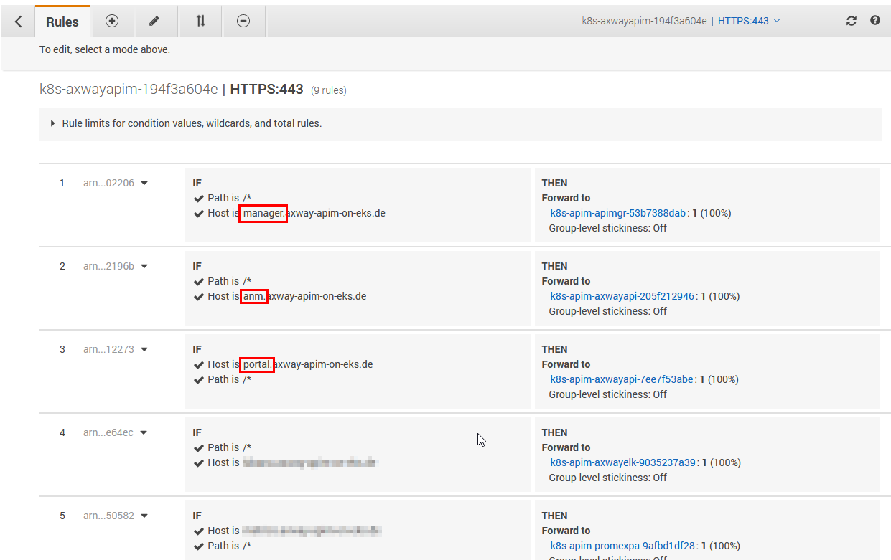
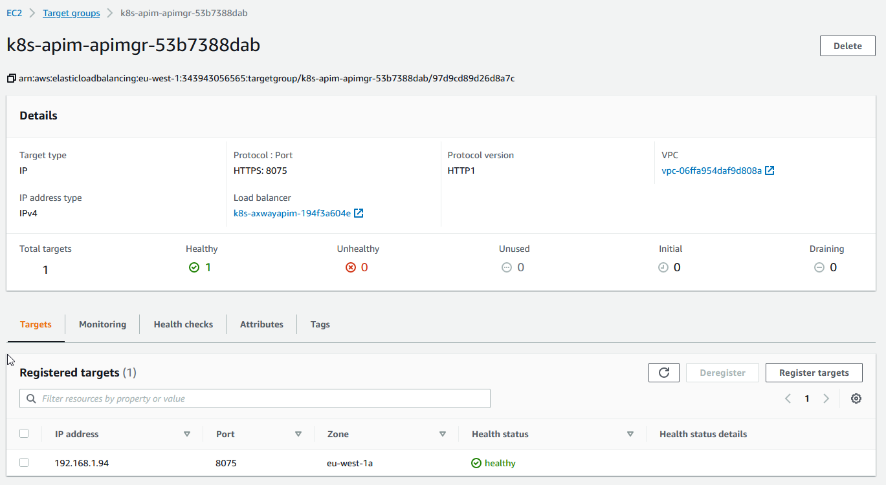
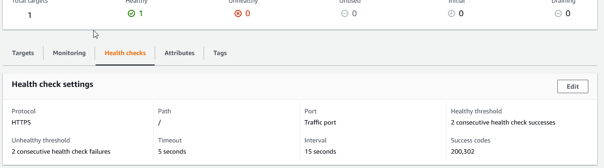

### AWS-EKS Deployment example

To deploy the solution on an AWS-EKS cluster you can use the following sample `local-values.yaml` as a starting point, which of course needs to be customized according to your environment.  

## Additional AWS-EKS Prerequisites

- A Kubernetes cluster configured in EKS
  - At least 2 nodes (e.g. m5.large)
  - If you plan to deploy the Elastic-Solution please configure at least 3 Nodes (e.g. m5.xlarge)
  - A namespace (e.g. apim) 
- `kubectl` configured and points to configured Kubernetes cluster
- Helm is installed and configured

## Installation

The installation on AWS-EKS is divided into some preparations and the actual installation of the solution using the HELM chart.

### Preparations

#### Domain- and DNS-Setup

To ultimately make the solution available, a number of ingress resources are created for the specified domain(s) (e.g., anm.axway-apim-customer.com) and AWS Load-Balancers are created based on them.  

If you want to use one or more new domains, then you should register them accordingly in advance. 
You have different possibilities up to the local `/etc/hosts` or you use the AWS --> [Route 53](https://console.aws.amazon.com/route53/v2/home#Home) to register your domain.. 

Here is an example of a registered domain using Route 53:  
  

With AWS, you have the option to dynamically create necessary DNS records based on created ingress resources for the domain. To do this, they need to install and set up [external DNS](https://kubernetes-sigs.github.io/aws-load-balancer-controller/v2.3/guide/integrations/external_dns/) in your Kubernetes cluster. 

```
kubectl -n default get pods 
NAME                                READY   STATUS    RESTARTS   AGE
dns-external-dns-7995bdd679-6p5fd   1/1     Running   0          2d23h
```

If everything is set up correctly, DNS records like the one below are automatically created and linked to the load balancer:  

  

#### Ingress-Controller

By default, no Ingress controller is installed on the deployed AWS EKS Kubernetes cluster. 
If this is not yet installed, please set it up as described here, as the Example-Values.yaml provided with the example annotations assumes that the AWS Load Balancer Controller is used.

```
kubectl get deployment -n kube-system aws-load-balancer-controller
NAME                           READY   UP-TO-DATE   AVAILABLE   AGE 
aws-load-balancer-controller   1/1     1            1           192d
```

#### Certificates

For services, such as the API-Manager, API-Traffic, etc. depending on the configuration one or more HTTPS Load-Balancers are created, that obviously require a certificate. 

Please use the AWS Certificate Manager to either import your own certificates or have AWS create them for you. Make a note of the corresponding ARN, as this is needed for the configuration of the ingress controller.

  

You can either link the created certificate concretely using an appropriate ingress annotation or the AWS ingress controller will attempt to discover the certificate based on the hostname. You can learn more [here](https://kubernetes-sigs.github.io/aws-load-balancer-controller/v2.3/guide/ingress/annotations/#certificate-arn)


### Helm install

For the installation of our Helmchart you have to create and maintain for future upgrades your own `local-values.yaml` file. As a starter, you may use our AWS-EKS [example](aws-eks-example-values.yaml) as a base. Use the following command to get a local copy:  

```
wget -o local-values-eks.yaml https://raw.githubusercontent.com/Axway/Cloud-Automation/master/APIM/Helmchart/examples/aws-eks/aws-eks-example-values.yaml
```

Now adjust the downloaded `local-values-eks.yaml` file according to your needs and version control it to make later upgrades safe and easy or to integrate it properly into your CI/CD-Pipeline.  
You can overwrite all parameters of the base [`values.yaml`](../../values.yaml), therefore our recommendation is to check it for appropriate configuration parameters inlcuding their documentation.

To finally start the deployment into your Kubernetes Cluster using Helm, use now the following command:
```
helm install axway-apim -n apim -f .\local-values-eks.yaml https://github.com/Axway/Cloud-Automation/releases/download/apim-helm-v2.3.1/helm-chart-axway-apim-2.3.1.tgz
```

Now check if the resources, such as pods, ingresses, services, etc. are created and correct any problems that occur.
```
kubectl -n apim pods get -w
```

You may watch the following videos to see a demonstration on an AWS-EKS deployment:  
### Admin-Node-Manager

[](https://youtu.be/nOqs06JsrDo)  

### API-Manager

[](https://youtu.be/xey4wR76CvU)  

### API-Gateways
[](https://youtu.be/UOo-A5vQPSg)  

### API-Portal
[](https://youtu.be/-RHBkLMNRnc)  

## Example screenshots

Since it can be helpful to know the target state, here's a set of screenshots of the AWS console illustration all different resources that were created during the deployment:  

#### EKS-Cluster Overview

  

#### Elastic Load-Balancer

  

#### Elastic Load-Balancer rules

  

#### Example target group API-Manager

  

#### Example target group API-Manager Healthcheck

  
