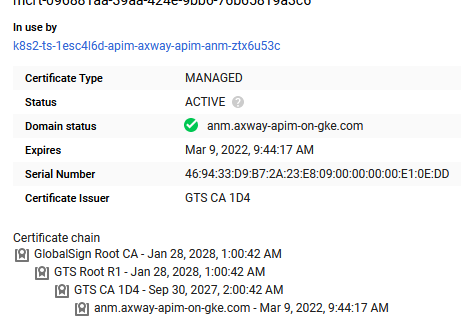

# Google Kubernetes Engine deployment

Here you can find information on how to deploy Axway API-Management solution on Google Kubernetes Engine (GKE) using our Helmchart. 

## Additional GKE Prerequisites

- A Kubernetes cluster configured in Google Cloud
  - At least 2 nodes (e.g. e2-medium)
  - If you plan to deploy the Elastic-Solution please configure at least 3 Nodes (e.g. e2-standard-4)
  - Create a namespace (e.g. apim) 
- `kubectl` configured and points to configured Kubernetes cluster
- Helm is installed and configured

## Installation

The installation on Google Kubernetes engine (GKE) is divided into some preparations and the actual installation of the solution using the HELM chart.

You may watch the following video to see a demonstration of the deployment to Google Kubernetes Engine:  

[](https://youtu.be/rtaaTc008Ig)  

### Preparations

#### Domain- and DNS-Setup

To ultimately make the solution available, a number of ingress resources are created for the specified domain(s) (e.g., anm.axway-apim-customer.com) and Google Load-Balancers are created based on them.  

If you want to use one or more new domains, then you should register them accordingly in advance. 
You have different possibilities up to the local `/etc/hosts` or you use the Google Cloud Platform --> Networks services --> [Cloud Domains](https://cloud.google.com/domains/docs/register-domain). 

Here is an example of a registered domain using Cloud domains and Google-Domains as the name service:  
  

Google does not support dynamic update of DNS records via ingress resources, so you must maintain the DNS records yourself. Here is an example using [Google-Domains](https://domains.google.com), each pointing to the belonging created Google load balancer:  
  

#### Certificates

The services, such as the API manager, API traffic, etc. are offered by the load balancers via HTTPS. You can provide the necessary certificates yourself in the GCP, store them as your own secret and reference them, or use Google-Managed certificates. 
In the example, [Google-Managed certificates](https://cloud.google.com/kubernetes-engine/docs/how-to/managed-certs) are used for each service. You can create these using the sample YAML file.

```
kubectl apply -n apim -f https://raw.githubusercontent.com/Axway/Cloud-Automation/master/APIM/Helmchart/examples/google-gke/google-managed-certificates.yaml
```

It may take a while until the certificates are available. Until then, you cannot connect to the HTTPS-based load balancer. 
Therefore, check if the status of the corresponding certificate bound to the load balancer is Active. You can find this under Google Cloud Platform --> Networks services --> Load balancing --> Pick a Load Balancer --> Click on the certificate

Here is an example of a valid active certificate:  
  

#### Ingress controller

According to the Ingress controller used in your environment appropriate annotations/configuration must be set to configure LoadBalancers based on the created Ingress-Resources. Our Helm chart is flexible to accept all kind of required configurations, such a custom annotations. However, which annotations to use for which Ingress controller is not part of this documentation. Please refer to the documentation of your Ingress-Controller, such as [NGINX](https://cloud.google.com/community/tutorials/nginx-ingress-gke) for more information.  

You may skip this topic, if you are using a custom Ingress-Controller, other than the default Google Ingress Controller (`kubernetes.io/ingress.class: "gce"`), which does not support extensive configuration via Ingress annotations. 

The standard [Google GKE ingress controller](https://cloud.google.com/kubernetes-engine/docs/concepts/ingress) (`kubernetes.io/ingress.class: "gce"`) requires Backend- and, if necessary, FrontendConfigs CRDs for configuration of certain aspects, like the Healthcheck. These BackendConfigs are linked to the corresponding services via an annotation. With the following command you can create the necessary BackendConfigs, which are already referenced in the provided sample `google-gke-example-values.yaml` below.

```
kubectl apply -n apim -f https://raw.githubusercontent.com/Axway/Cloud-Automation/master/APIM/Helmchart/examples/google-gke/google-backend-configs.yaml
```

This is example annotation pointing a service to a backend configuration object:
```
apitraffic:
  ...
  service:
    ...
    cloud.google.com/backend-config: '{"default": "apitraffic-backend-config"}'
```

### Helm install

For the installation of our Helmchart you have to create and maintain for future upgrades your own `local-values.yaml` file. As a starter, you may use our Google Cloud GKE [example](google-gke-example-values.yaml) as a base. Use the following command to get a local copy:  

```
wget -o local-values-gke.yaml https://raw.githubusercontent.com/Axway/Cloud-Automation/master/APIM/Helmchart/examples/google-gke/google-gke-example-values.yaml
```

Now adjust the downloaded `local-values-gke.yaml` file according to your needs and version control it to make later upgrades safe and easy or to integrate it properly into your CI/CD-Pipeline.  
You can overwrite all parameters of the base [`values.yaml`](../../values.yaml), therefore our recommendation is to check it for appropriate configuration parameters inlcuding their documentation.

To finally start the deployment into your Kubernetes Cluster using Helm, use now the following command:
```
helm install axway-apim -n apim -f .\local-values-gke.yaml https://github.com/Axway/Cloud-Automation/releases/download/apim-helm-v2.3.1/helm-chart-axway-apim-2.3.1.tgz
```

Now check if the resources, such as pods, ingresses, services, etc. are created and correct any problems that occur.
```
kubectl -n apim pods get -w
NAME                                    READY   STATUS    RESTARTS   AGE
apimgr-6868c4695f-42q9f                 1/1     Running   0          5m46s
axway-apim-anm-59b85f46f4-p2lf5         1/1     Running   0          5m46s
axway-apim-apiportal-59c86c5bc7-5kv99   0/1     Running   0          5m46s
cassandra-0                             1/1     Running   0          5m46s
mysqlapiportal-0                        1/1     Running   0          5m46s
mysqlmetrics-0                          1/1     Running   0          5m46s
traffic-5b9b56887b-f8lcm                1/1     Running   0          5m45s
traffic-5b9b56887b-tl66k                1/1     Running   0          5m46s
axway-apim-apiportal-59c86c5bc7-5kv99   1/1     Running   0          5m54s
```

## Example screenshots

Since it can be helpful to know the target state, here's a set of screenshots of the Google cloud management interface illustration all different resources that were created during the deployment:  

#### Services & Pods

  

#### Ingresses

  

#### Load-Balancers

  

#### Storage

In the sample values file provided, persistent volumes for API Gateway Events, OpenTraffic, Audit and Traces are disabled and an emptyDir volume is used. If you are using the Elastic solution this is fine as the log information is then streamed to Elasticsearch via Filebeat. 
Otherwise, you need to disable the PVCs and configure them according to the environment.

  

#### Frontends

  

#### Backends

  

#### Health checks

  
