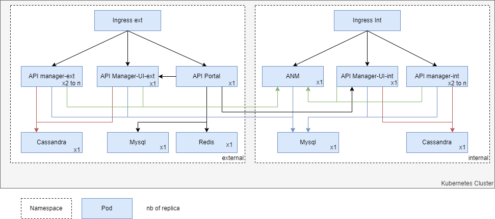

# Multiple API Gateway groups deployment example

The target of this section is to deploy multiple API Gateway groups in Kubernetes.
The following sampls are platform agnostic and you will have to adapt them in your context.

Note : It's possible to use the same Cassandra instance and to disable Redis component to decrease resources usage.

## Additional Kubernetes Prerequisites

To deploy this solution, you need to have configured:
- A Kubernetes cluster kwith minimaly 3 nodes
- Clients kubectl and helm v3 installed

## Installation

### Preparations

 Please follow the appropriate instructions in other README example according your environment/

#### Domain- and DNS-Setup

You need 2 subdomains minimally. Both of them can listen on a public or private IP.

#### Ingress-Controller
It's recommended to use 2 ingress controllers deployed Although it's possible to use external services.
