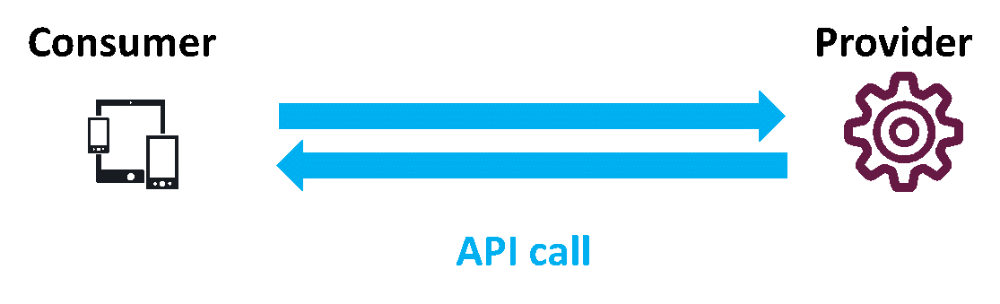
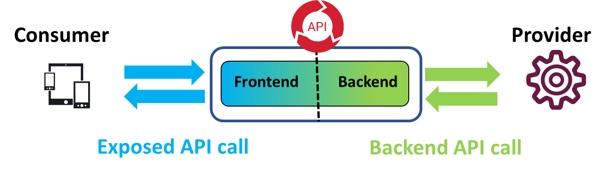

# API Management basics

Let summarize the essence an API call: a **"Consumer”** consumes an **"API"** provided by a **"Provider”**.

In REST, interactions are done with HTTP, leveraging its concepts of URL and verbs. To be used, an API requires a description, either purely documentation or better, computer-usable format like Swagger.

A core concept of APIs is that consumer only cares about the API contract. The technology used by the provider or its location does not matter. 
Using an API Management solution means to virtualize an API. Provider's API definition is imported (or manually created) in the API Management solution, then exposed to consumers. So API Management solution acts like the provider and it is “virtually” the provider.

There are 2 parts in a virtualized API:
 - **Frontend**: part exposed to consumer
 - **Backend**: part connecting to provider

This concept of **Frontend** and **Backend** is exactly how the configuration in API Manager is done.
Simple virtualization means exposed API and backend API are the same. This is the case in this scenario. Axway solution can also mediate the call, so exposed API and backend are different. This is notably the case of SOAP to REST, called “RESTification”.

There are many benefits of using an API Management solution, notably security, visibility, mediation, standardization and the most important: leveraging API consumption.

**Next:** [Prepare your environment](../Preparation)