## Consumer point of view 

So far, we were acting as a provider. And now, let's play as a consumer: Dave.

A consumer wants to do basically 3 things:
- Browse API Catalog, search good APIs and read documentation
- Get credentials to use the selected API and test them 
- Check the consumption of the APIs used in his/her applications

Consumer could also use API Manager. Still, **API Manager is intended to be the provider interface and API Manager the consumer interface** and this is why API Portal exist.

API Portal's greatest advantage compared to API Manager is its customization capabilities. It includes branding, catalog customization and even federation of multiple API Manager. 

So let's move to API Portal web UI.

Let's connect as Dave:
- Open a new tab in Firefox (blue **"+"** button)
- Click on the **"Portal"** shortcut available (*for those who use reference environment*) or enter the url of the Portal : https://\<hostname\>
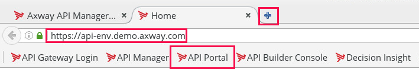

The welcome screen opens:
- Click **"Sign In"**

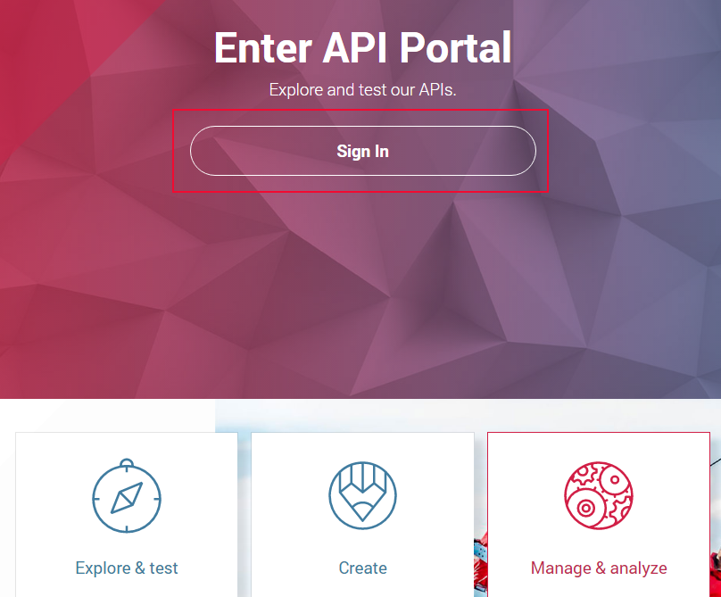

Provide user credentials:
- **Login Name**: dave
- **Password**: dave for the local reference environment or given by your techlab animator.

### API Catalog

First, let’s access the API catalog:
- The menu API Catalog should already be open. Click **"APIs"** if it is not the case.
- Click **"OMS_\<your name\>_v1"** for more details
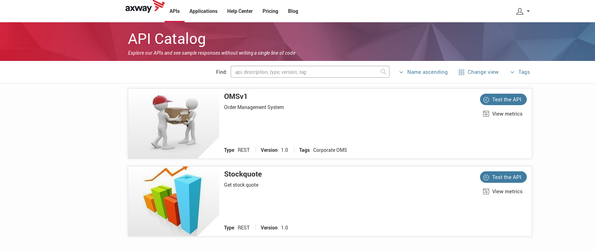

The documentation allows an application developer to discover the functionality of an API.
The service contract of an API is available in the API Portal in Swagger 2.0 format.
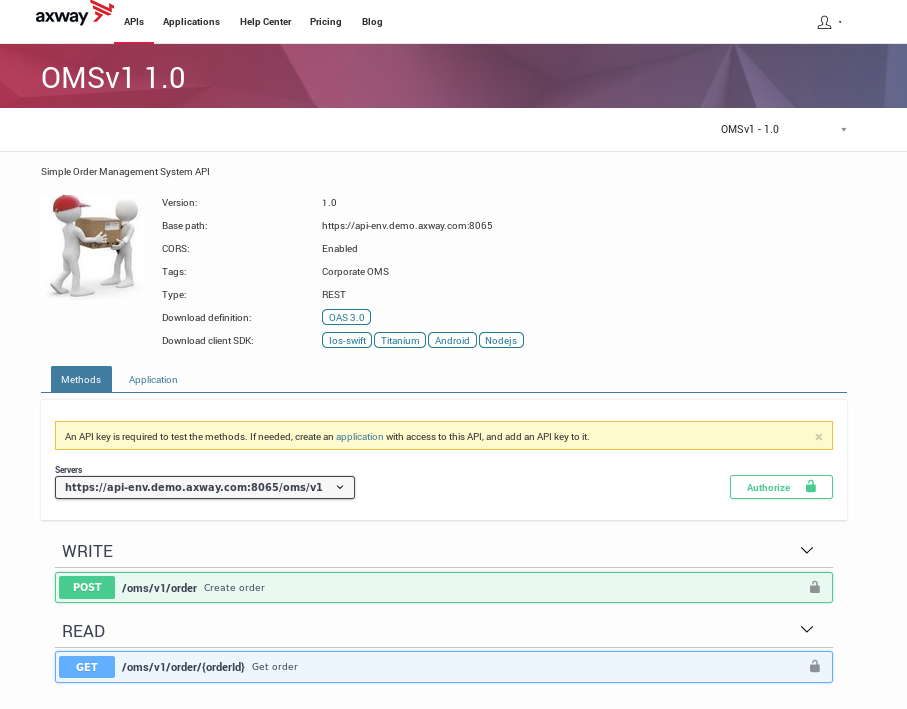

Dave wishes to get information on the GET method:
- Click **"GET"**

Looking at the description of the API method, an API key is required. 

The next step consists of creating one.

### Application

The creation of an API key is done through the creation of an **"Application"**. 

An **"Application"** represents a set of API usage rights for the final application (e.g. a mobile application).
- Click on the menu **"Applications"**
- Click **"Create application"**
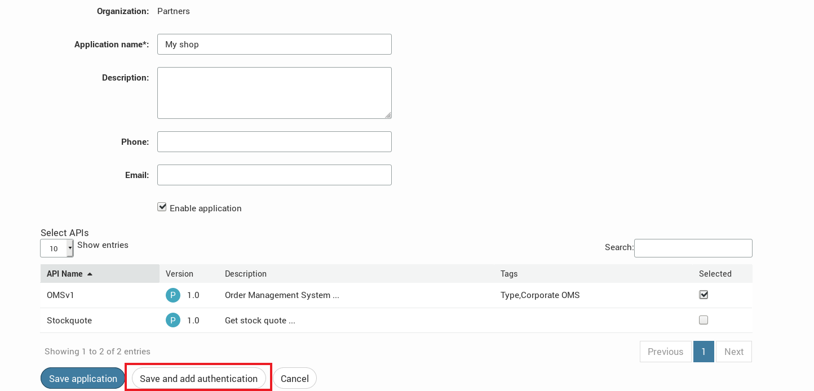

- Enter **"\<your name\> shop"** in the field **"Application name"** 
- Check **"Enable application"** to activate the application
- On the bottom, in the table **"Select APIs"**, check the box corresponding to **"OMS_\<your name\>_v1"**
- Click **"Save and add authentication"**.

- Go to the **"Authentication"** Tab
- Open **"API KEYS"**
- Click **"Generate"**
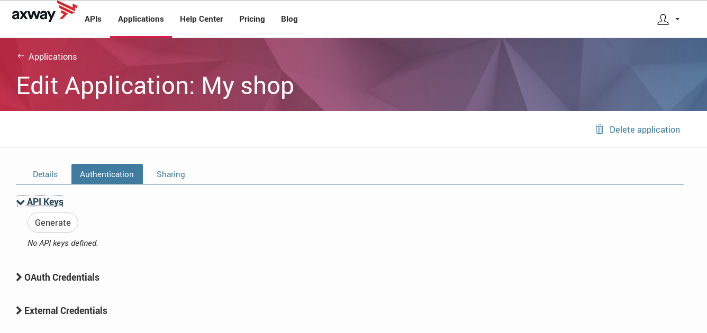
 
An API Key is generated:
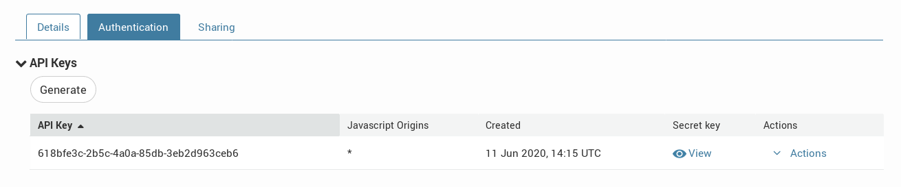

It is now time to test the API.
- Click on the menu **"APIs"**
- Click **"Test the API"** for the OMSv1 API.
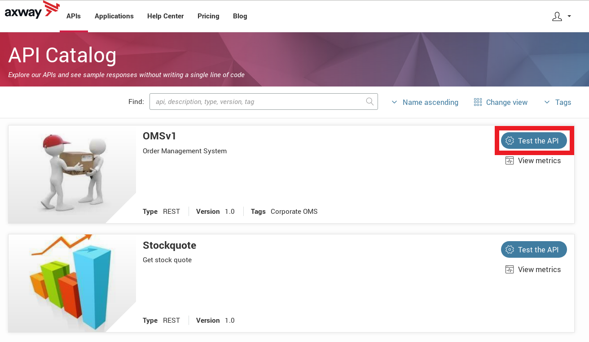

- Click the drop-down many for **"API Key"** and select the My shop key.
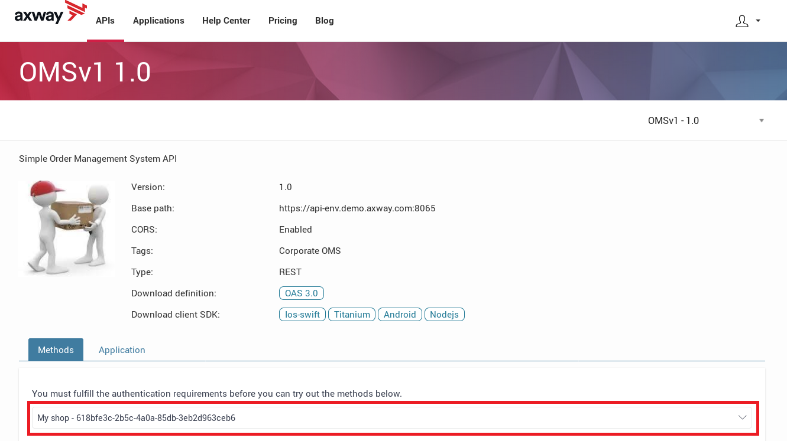
 
You can now test the GET method in of the OMSv1 API. 

- Click **"GET"** then **"Try it out"** button
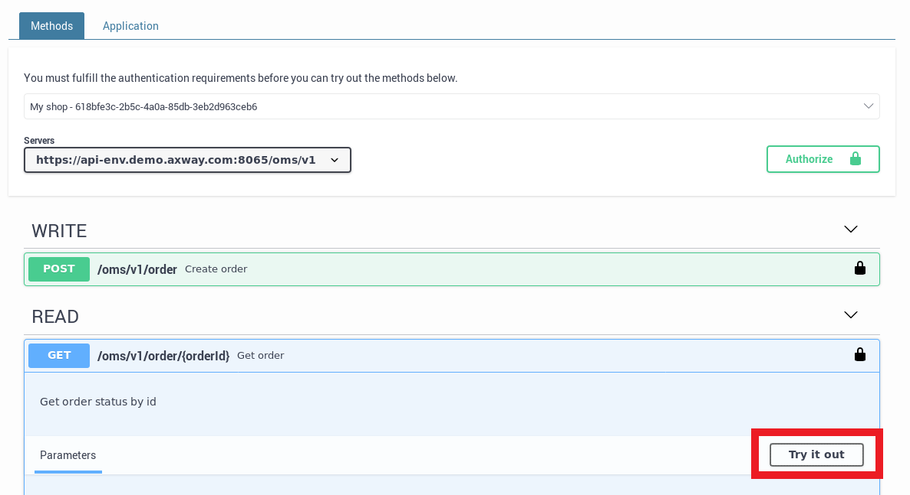

- Enter a random value (e.g.123123) in the **"orderId"** field
- Click **"Execute"**
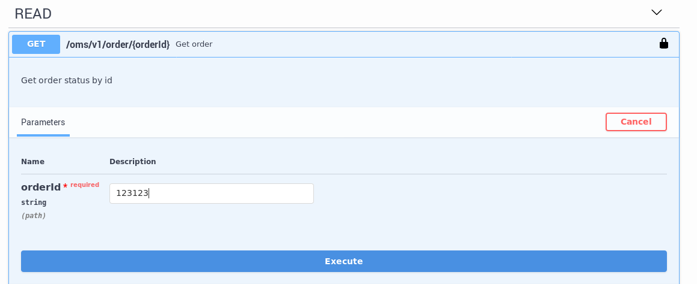

It works, you have a successful response! 
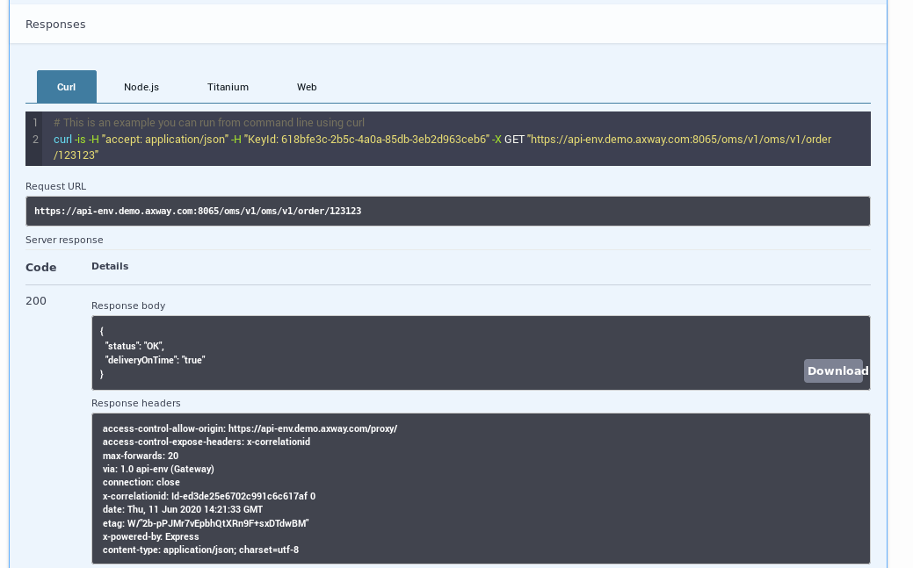

###	Monitoring
Dave can also check details on the consumption of his application with the embedded monitoring:
- Click **"APIs"** then on **"View metrics"**
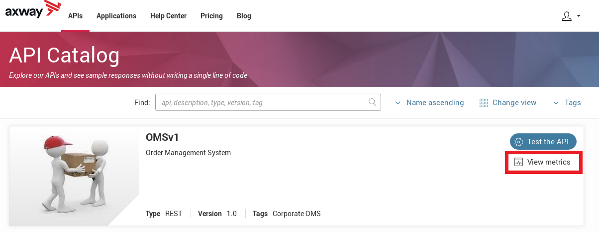

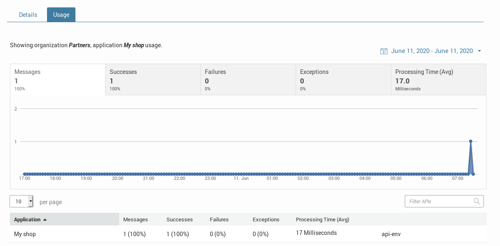

Dave can access all his applications and select search criteria, but only on the application and APIs he can access.

### Conclusion
Congratulations, you have seen in this exercise how to secure an API and how to make it available to a community of developers through the API Portal!
