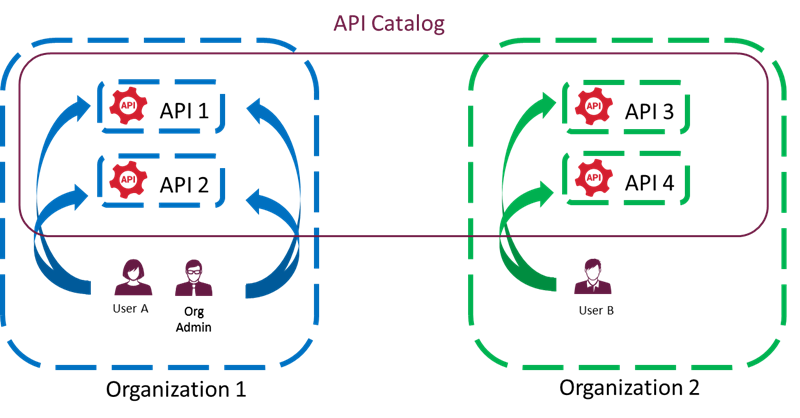
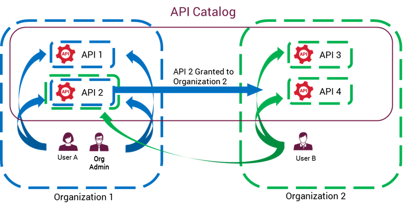
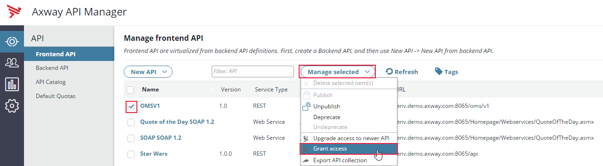
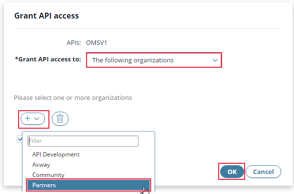
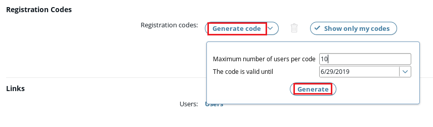

## Manage access

### Access model

Here is a short explanation about the API Catalog and how users access APIs.

- Users and APIs belongs to an organization. 
- API Catalog is the set of all APIs, from all organizations. 
- A user only see a part of the API Catalog. If a user see an API, he/she can consume it.
- An user can have one of several roles. 
- A user can always see and consume APIs from his/her organization. 

Here is an example, with 2 organizations and 3 users.
At this stage user B can see in catalog API 3 and API 4 and User A can see API 1 and API 2.

To have access to an API belonging in another organzation, the access must be **"granted"** first. 
Access to the API can be granted to one or multiple organizations at the same time. 

In our example below, API 2 of Organization 1 was granted access to Organization 2. Now User B can access in catalog API 2, API 3 and API 4.

This is a very simple and efficient model. 

### Grant access

Now let's apply it in our environment.
“OMSv1” belongs to the organization **“API Development”**. 
This organization is capable of virtualization and **intended only for internal developers**.

To make the “OMSv1” API available to a broader audience, we need to grant its access. 
Let's do it with the “Partners” organization:
- Select the check box next to the “OMS_\<your name\>_v1” API in the **“Manage frontend API”** screen
- Click **“Manage selected”** in the top menu

- Select **“Grant access”**

A new window “Grant API access” appears:
- Select “The following organizations” for the field “Grant API access to”
- Click “+”
- Select “Partners”
- Click “OK”

A confirmation window “Grant access” appears:
- Click “OK”

Up to now, the scenario has been realized with the “apiadmin” account, which is an Administrator: so all rights and access to all organizations. 

The Organization administrator role is able to manage users in an organization. 
For instance, he/she can provision registration codes, that can be used self-registration process :

Now, let's play the role of a consumer.

**Next:** [And finally, let's consume our API](../Consume_API)