## Publish API

We virtualized the OMS backend. Very simple indeed. 
We tested the API, so it works already. But is it a good enough for API consumption? There are few additional topics to have in mind, especially:
- Change authentication mechanism
- Update the documentation
- Change API status
- Put quotas in place

### Change authentication mechanism
Let’s go back to the **"Frontend API"** to change the authentication mechanism:
- Go back to **"API Manager"** web UI
- Select **"Frontend API"** in the menu **"API"**
- Type **"oms"** in filter APIs and find the OMS API with your name
- Click on it
 
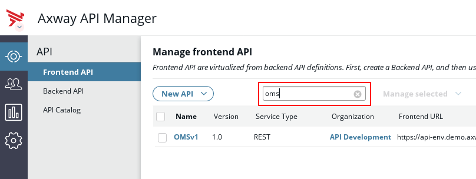

 In the **"Inbound"** tab,
- Select **"API Key"** for the field **"Inbound security"**

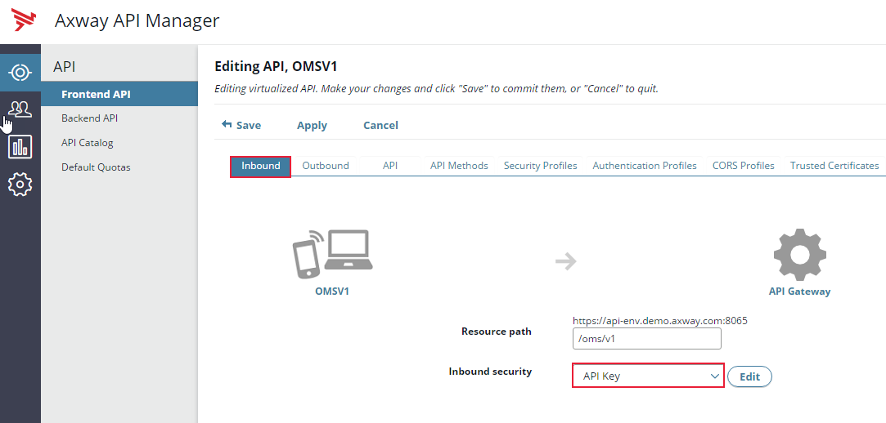

In a new window, **"API Key Device"** appears:

 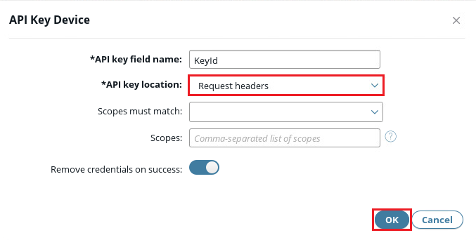

**"API key field name"** will be the name of the field containing API Key (it will be passed in an http header)
**"API key location"** will be the location of the API key field

- Click **"OK"** (Leaving the default options, the API key is passed in an http header)

Now calling our API requires an API Key.

### Update the documentation
Now we will complete information related to this API. 
- Click the **"API"** tab.
- Click **"Add image"**

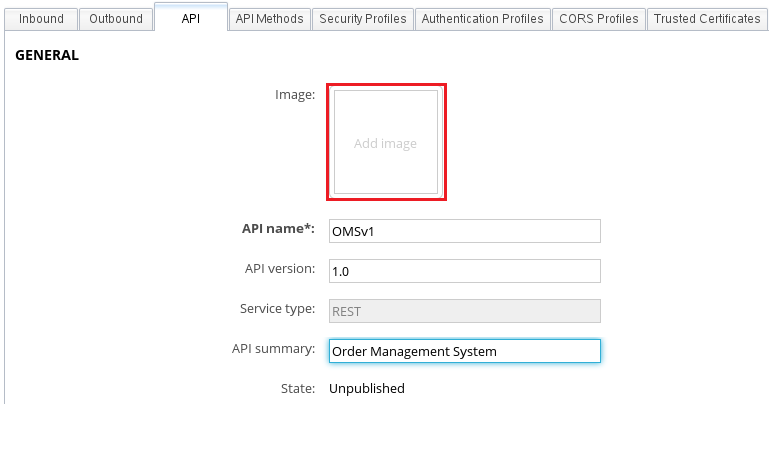

The menu **"File Upload"** opens:

If you are working on a local virtual machine, get the file locally here :
- Click **"Axway"** -> **"TechLab"** -> **"TechLabs Resources"** 

If you are working on a remote browser,  download the file in attachment OMS.jpg

- Then select **"OMS.jpg"**
- Click **"Open"**
 

You should have the following screen:

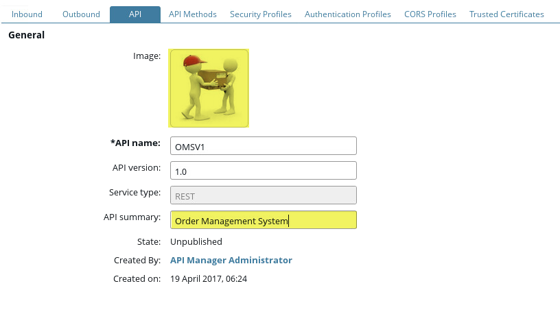

The tags allow application developers to search for APIs in the API Catalog. Let’s add one:
- At the bottom of the tab **"API"**, in the section **"Tags"**, create a new tag by clicking **"+"**

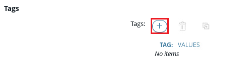

Note: You may need to scroll down to see **"Tags"**
 
Enter **"Type"** in the field **"Tag"** 
- Enter **"Corporate OMS"** in the field **"Values"**

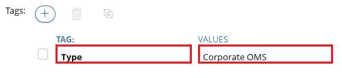

The update of the **"Frontend API"** is now finished. 
- Click **"Save"** at the top of the page

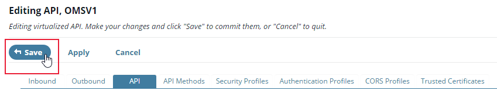

### Change API status

The last step consists of publishing the API into **API catalog** from **"Manage frontend API"** menu

- Check the box next to the **"OMS_\<your name\>_v1"** API

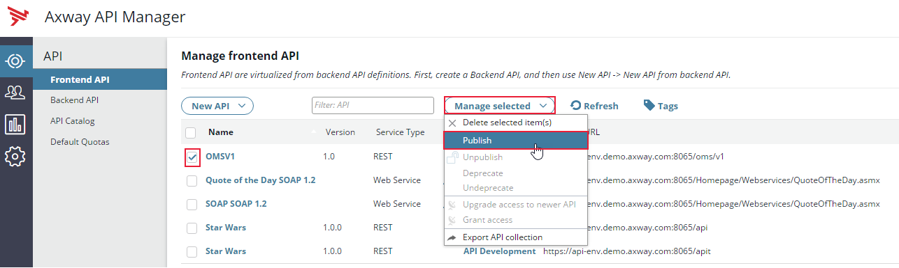

- In the top menu, click **"Managed selected"**
- Select **"Publish"**

Leave the default values in the window **"PUBLISH API"** that pops ups:
- Click **"OK"**

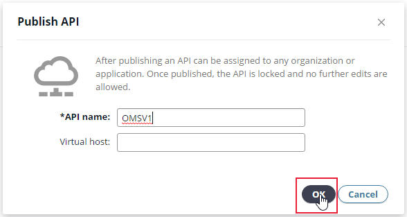

The status of the API becomes **"Published"**: your API is now published!

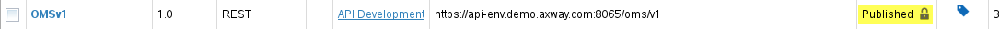

### Put quotas in place

Now we will set quota to protect our backend servers and allocate resources between the applications. We will configure two types of quota:
- A global system quota: API Manager calculates the total amount of transactions for all the applications
- A quota per **"Application"**: API Manager measures the number of transactions per application

To limit the number of transactions on a system level (100 transactions per second):
- Select the menu **"Clients"**
- Click **"Default Quotas"**
- Click **"System"**

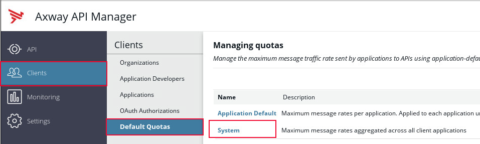

- Click **"Add API"**
- In the list, select **"OMS_\<your name\>_v1"** (you may start typing in the **"Filter"** text box for quick selection of an API)

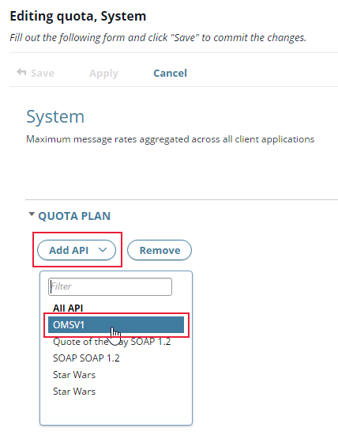

- Set the number of messages as **"100"**
- Set the number of seconds as **"1"**
Note: if these 2 values are not entered, the orange button indicates that there are still invalid fields.

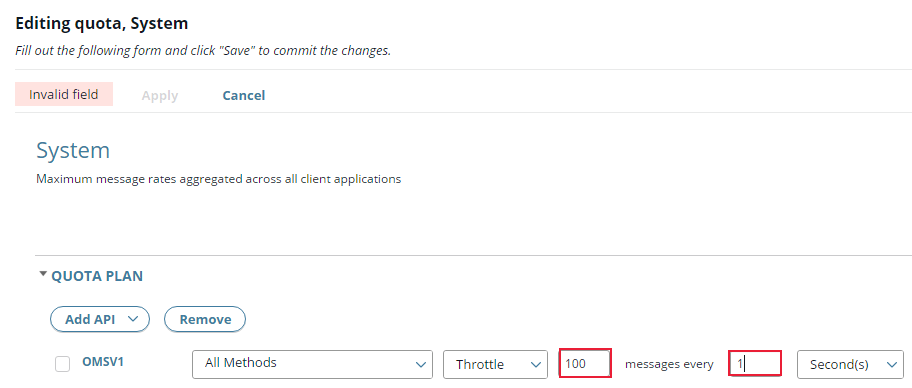

- Click outside the field and click **"Save"**

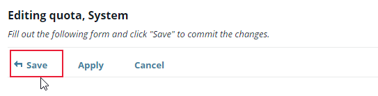

To limit the number of transactions per application (a transaction every 3 seconds):
- Click **"Application Default"**
 
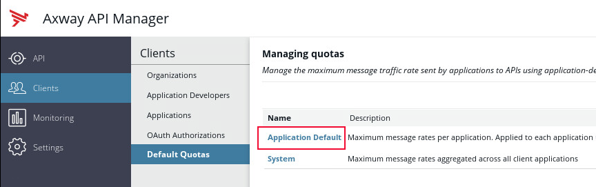

- Click **"Add API"**
- Select **"OMS_\<your name\>_v1"** 
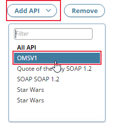

- Set the number of messages as **"1"** and the number of seconds as **"3"**
- Click outside the field and click **"Save"**

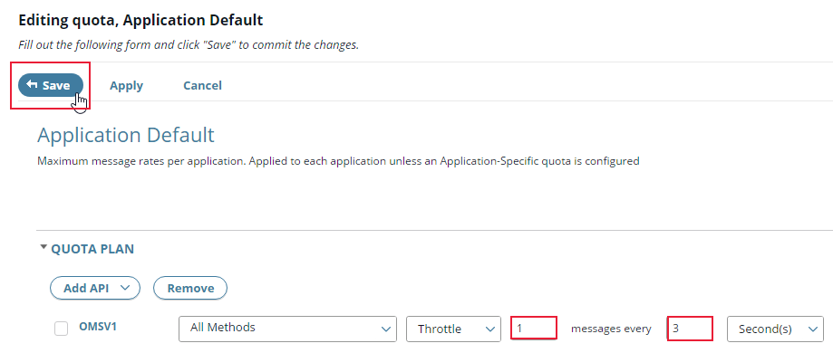

This configuration allows the API Manager to apply the following quota:
-	The total amount of calls to the OMSv1 API, for all methods and all consumers, is limited to 100 messages per second. This prevents an overload of the backend system.
-	By default, an application can make 1 call every 3 seconds. This allows to allocate resources between all the applications. This is default behavior and this behavior can be overwritten on per application basis.

OK, with all of that, our API is ready to be consumed!

**Next:** [Let's manage access](../Manage_access)
