## Virtualize API

### Create Backend API

The **"Backend API"**  defines how to connect to the provider. It can be created manually, still the simpliest solution is to import API description.
In this example, we are using Order Management System **"Swagger"**  definition.
- Click on the tab **"API"**, 
- Select **"Backend API"**  in the menu
- Click **"New API"**
- Select **"Import Swagger API"**

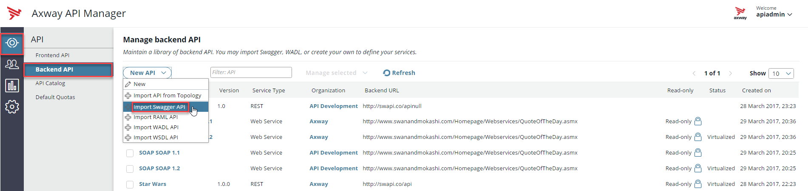

You are currently in the menu which allows to create or reference an API that will be managed by the API Manager
In the window **"Import from"**,
- In **"Source"** field, select  **"Swagger definition URL"**  
Provide the following information
- **"URL"**: **http://backend:5080/mockup/oms/v1/swagger**
- **"API Name"**: **"OMS_\<your name\>_v1"**  add your name to set a unique identifier for the API name.
- **"Organization"**: Select **"API Development"**
Then click **"Import"**

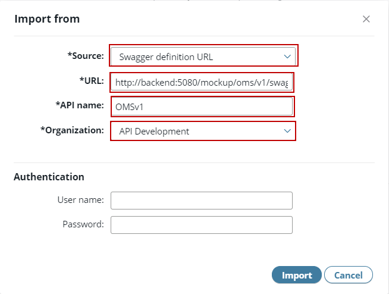

The API is successfully imported.
- Click **"OK"**

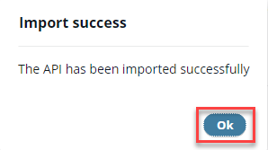

Let’s have a look at the imported API
Click the **"OMS_\<your name\>_v1"**  API in the list (you may need to select **"All"**  in the **"Show"**  drop-down menu on the right)

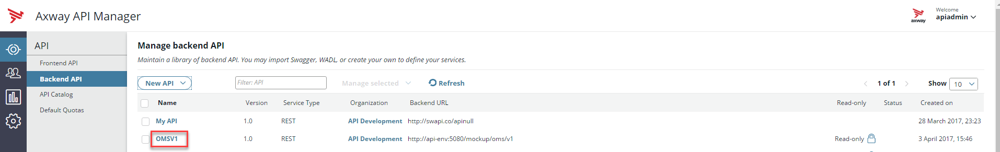

In the first tab **"API"**, you find all the general information like name, type (REST or SOAP), Base Path URL, Resource Path and a summary.
 
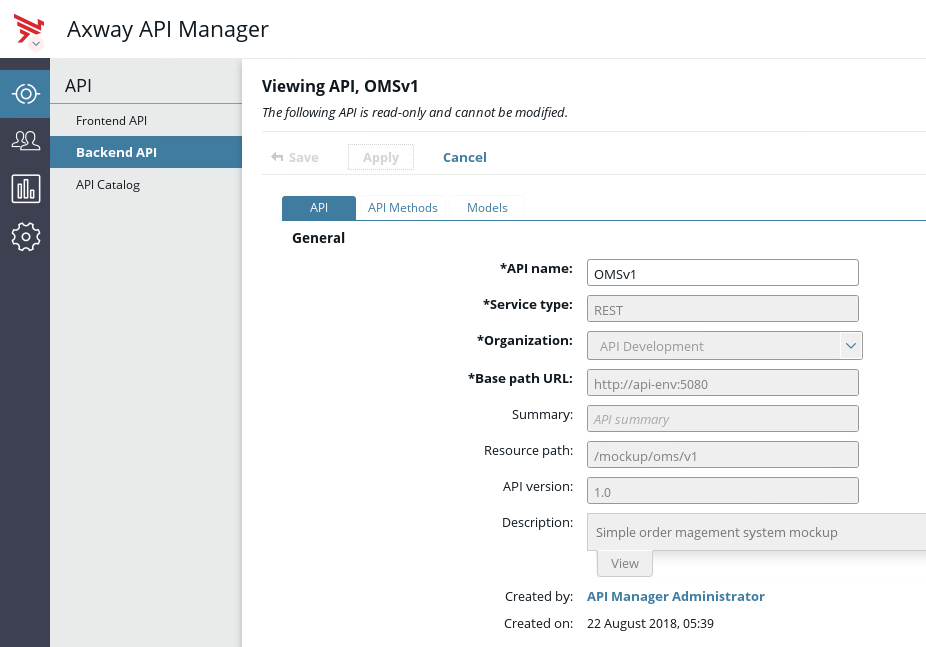
 
The second tab **"API Methods"**  shows all the available API Methods belonging to the API:
- Click **"API Methods"**. The OMS API provides two methods **"read"**  and **"submit"**.

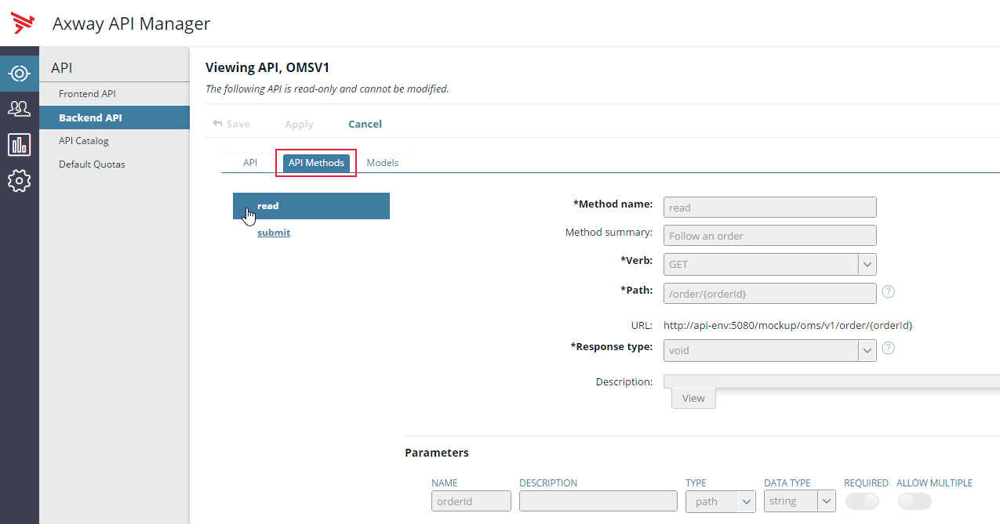

In the next steps, we will use the **"read"**  method to follow an order.

 
### Create Frontend API  
Frontend API defines how the API will be exposed, so how consumers will see and interact with it.
In API Manager UI
- Select the tab **"API"**
- Select the sub-tab **"Frontend API"**
- Click **"New API"**
- Select **"New API from backend API"**

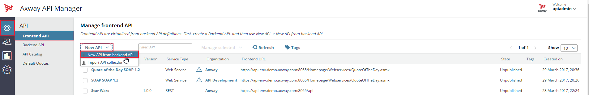

- Select **"OMS_\<your name\>_v1"** in the list
- Click **"OK"**

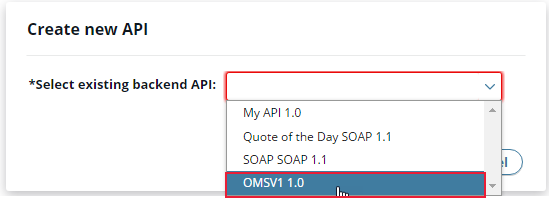

Frontend API panel appears.
In the tab **"Inbound"**,
- Replace the default value **"/mockup/oms/v1"**  by **"/oms_\<your name\>/v1"**  in the field **"Resource path"**, to set a unique exposition path.
Remark: the URL is deducted from the machine name as defined in the settings tab
- Select **"Pass Through"**  in the field **"Inbound security"**. This allows to verify if the API is working without having to manage access rights. We will change it later.

A configuration window **"Pass Through Device"**  appears.
- You can enter a custom subject name that will be displayed on the Traffic tab in API Gateway Manager
- Keep the default value and click **"OK"**

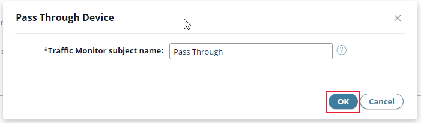

- Click **"Save"**

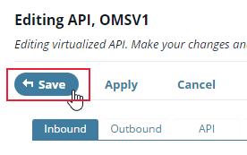

The API is now ready to be tested.
- Open a new tab in your web browser
- Enter the URL: **"https://\<hostname\>:8065/oms_<your name\>/v1/order/123123"**
- Click **"enter"**  on the keyboard 

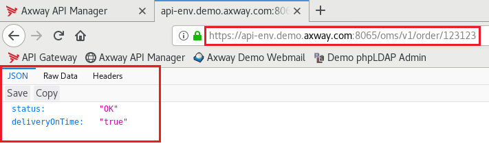

The resource is consumed and returns a value: it works!

**Next:** [Let's publish our API](../Publish_API)