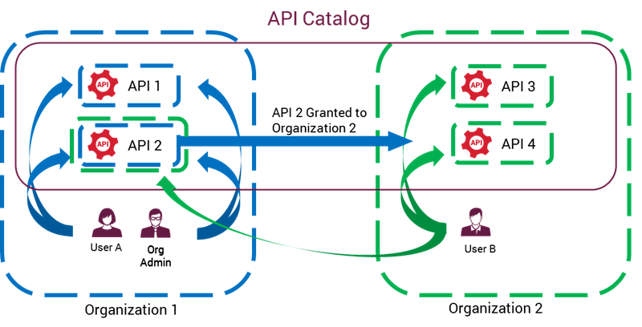
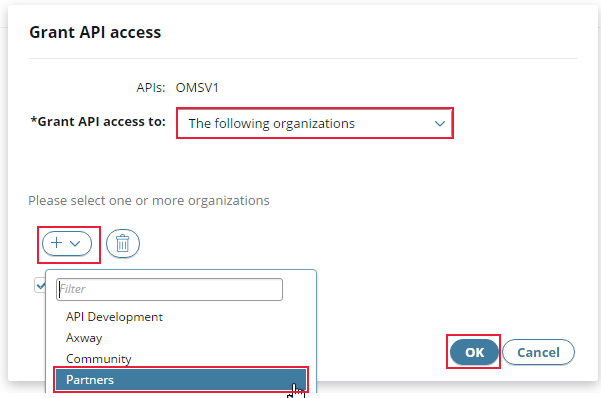

## Manage access

### Access model

Here is a short explanation about the API Catalog and how users access APIs.

Users and APIs belongs to an organization. API Catalog is the set of all APIs, from all organizations. A user only see a part of the API Catalog. If a user see an API, he/she can consume it.
An user can have one of several roles. A user can always see and consume APIs from his/her organization. 

Here is an example, with 2 organizations and 3 users. At this stage user B can see in catalog API 3 and API 4.

To have access to an API belonging in another organzation, the access must be **"granted"** first. Access to the API can e granted to one or multiple organizations at the same time. In our example, API 2 of Organization 1 was granted access to Organization 2. Now User B can access in catalog API 2, API 3 and API 4.

This is a very simple and efficient model. 

### Grant access

Now let's apply it in our environment.
“OMSv1” belongs to the organization “API Development”. This organization is capable of virtualization and intended only for internal developers.
To make the “OMSv1” API available to a broader audience, we need to grant its access. Let's do it with the “Partners” organization:
- Select a check box next to the “OMS_\<your name\>_v1” API in the “Manage frontend API” screen
- Click “Manage selected” in the top menu

- Select “Grant access”

A new window “Grant API access” appears:
- Select “The following organizations” for the field “Grant API access to”
- Click “+”
- Select “Partners”
- Click “OK”

A confirmation window “Grant access” appears:
- Click “OK”

Up to now, the scenario has been realized with the “apiadmin” account, which is an Administrator: so all rights and access to all organizations. 

There is the Organization administrator role, able to manage users in an organization. For instance, he/she can provision registration codes, that can be used self-registration process.

Now, let's play the role of a consumer.

**Next:** [And finally, let's consume our API](../Consume_API)