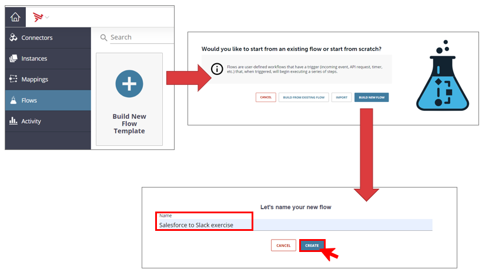
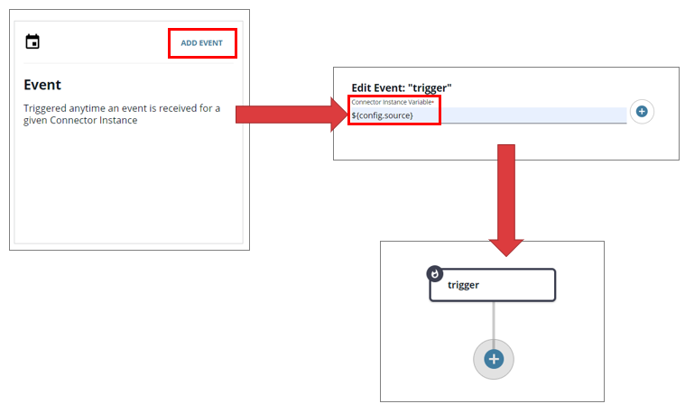
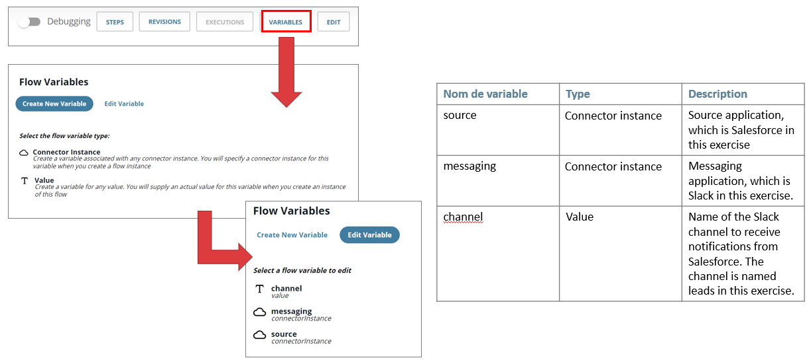
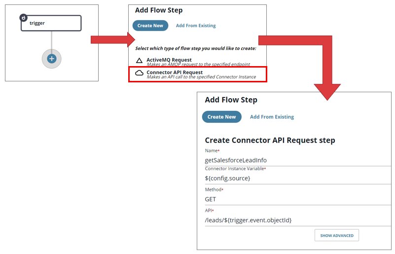
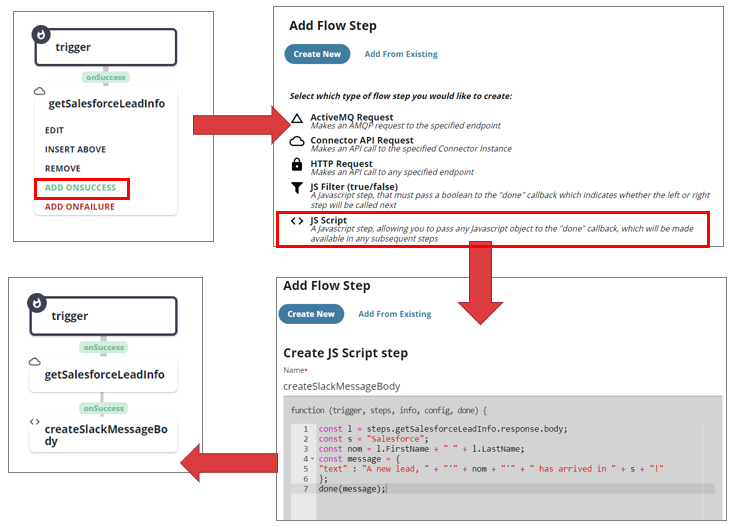
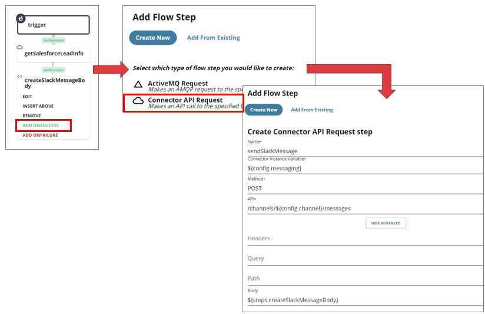
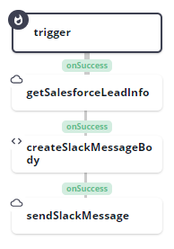

## 5. Create Cloud2Cloud flow

- In Integration Builder, select the Flows tab and click **"Build New Flow Template"**
- Click **"Build New Flow"**
- Type the following flow name **"Salesforce to Slack exercise"** and click **"Create"**

- Click **"Add Event"** on Event tile
- Type **${config.source}** on the field **"connector instance variable"**.
- Click **"Save"**. A flow diagram is displayed with “trigger”

Click on **"Variables"**, and define three variables like the following table, and click on **"Cancel"** to validate the creation : 

- Click **"+"** below the «trigger» step
- Click **"Create New"** and select **"Connector API Request"**
- Complete the following fields and click **"Save"**:
    - Name: **getSalesforceLeadInfo**
    - Connector Instance Variable: select the source variable : **${config.source}**
    - Method: Select **"GET"** from the drop-down list
    - API: **/leads/${trigger.event.objectId}**

- Click on **"getSalesforceLeadInfo"** step, and select **"ADD ONSUCCESS"**
- Click on **"JS Script"**
- Type the following name **createSlackMessageBody**
- Put the following JSON code, and click **"Save"**:

*const l = steps.getSalesforceLeadInfo.response.body;*

*const s = "Salesforce";*

*const nom = l.FirstName + " " + l.LastName;*

*const message = {*

*"text" : "A new lead, " + "'" + nom + "'" + " has arrived in " + s + "!"*

*};*

*done(message);*

- Click on **"createSlackMessageBody"** step, and select **"ADD ONSUCCESS"**
- Click on **"Connector API Request"**
- Type the following values and click **"Save"**:
    - Name: **sendSlackMessage**
    - Connector Instance Variable: select the messaging variable **${config.messaging}**
    - Method: Select **"POST"** from the drop-down list
    - API: **/channels/${config.channel}/messages**
    - Under Show Advanced, Body: **${steps.createSlackMessageBody}**

The completed flow diagram should look like the following image :

**Next:** [Now let's create an instance of our flow](../6. Instantiate Cloud2Cloud flow)

