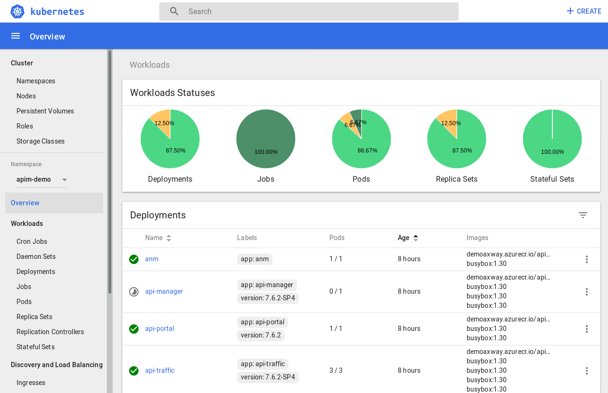
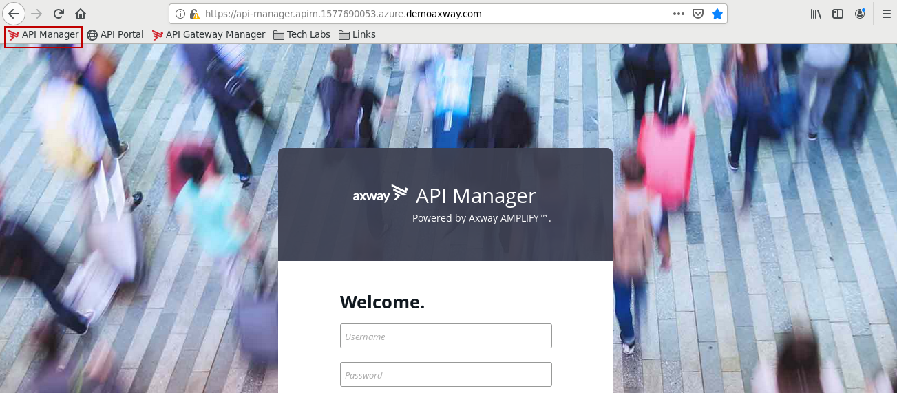

## Auto-healing

Use following command in the shell:
```
k delete --force --grace-period=0 $(k get pods | grep api-manager- | cut -f 1 -d " ")
```

This will brutally stop the pod corresponding to API Manager. Since there should be 1, it will be automatically restarted. So we have this in Kubernetes Dashboard.


After few seconds, it will be restarted.


You can test to access API Manager using web browser shortcut.


**Next:** [Elasticity](../Elasticity)
