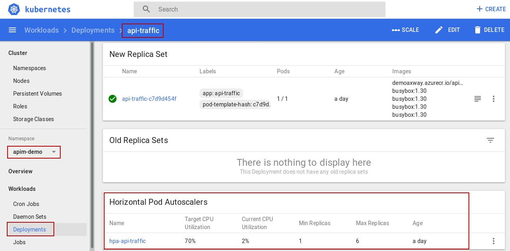

## Auto-scaling

Auto-scaling will take care of the number of replicas, according to the resources consumed by the system. 

Let's take a look at current configuration for api-traffic. Remember, to get there:
- be sure your namespace is selected
- go to **"deployments"**
- select **"api-traffic"**
- scroll down to **"Horizontal Pods Autoscalers"**


So we changed already **"Min Replicas"** to 1. **"Max Replicas"** is 6.
Criteria is CPU. Target is 70%. As we can see current CPU is pretty low.

Please look [here](https://kubernetes.io/docs/tasks/run-application/horizontal-pod-autoscale/) for more details about how Kubernetes work. 


Let's do a simple test to activate auto-scaling. API Gateway provides a small utility called **"sr"** to generate load. We will start Kubernetes job, using this utility and doing lot of requests.

To trigger it, in your shell execute:
```
/home/axway/demo/script/autoscaler_load_generator.sh
```

Let's look at its log in Kubernetes Dashboard:
- on left panel, select job
- in the list, go to **"loadgenerator"**

- click on **"LOGS"** button on top

A new tab opens in web browser
- in top menu bar, click on the circle arrow to ativate autorefresh button
- be sure the page is scrolled down


Our test case is sending request to /healthcheck, emulating many consumers at the same time. Expected result is a OK message with 200 HTTP code.
Every 5 seconds, **"sr"** writes logs about current test status. So it is possible to follow the ongoing test.

Note: purpose of this test case is only to get a good traffic throughput. It is not to reach the maximum throughput. 

Here is a short explanation about the most relevant information: 

- transactions/sec: indicator of global system performance
- protocol/connections error: as name stands. Expected result is 0
- transactions by HTTP responses code: only 200 is expected for now 

If we go back to api-traffic deployment, we can see the number of pods have scaled.


It is possible also to see the traffic for the solution.

For that, connect to the **"API Gateway Manager"**
- open a new tab in the web browser
- select **"API Gateway Manager"**
- provide credentials
__login__: admin
__password__: changeme 


It opens to the **"Dashboard"** page.


As you can see there is some traffic. And very important, there is no failure.


Let's keep the load generator for now and move to the next chapter!

**Next:** [Zero downtime deployment](../ZDD)