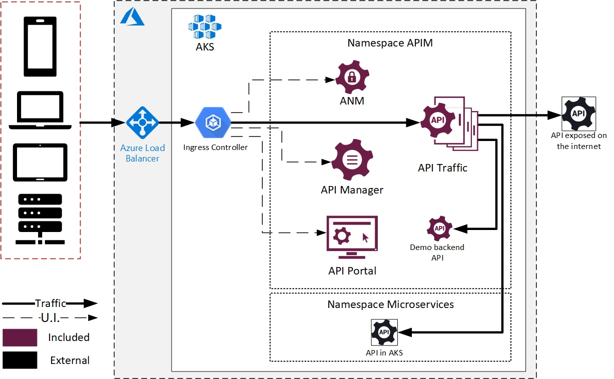

## Elastic deployment

Elastic deployment provides unique architecture advantages compared to software installation. Axway API Management solution is deployed in a 3 nodes Azure Kubernetes Service (AKS).

Here is a functional architecture schema:

- Axway API Management is exposed through Azure load balancer and AKS ingresses
- API Traffic is handled by instances with 3 replicas. So the solution is deployed in high availability
- UIs are also exposed. ANM is for admininstrator, API Manager is for API providers and API Portal is for consumers. There is only one replica for each. It is possible to have multiple replicas and high availbility, but auto-healing was said to be enough. And it saves resources (and cost) too  
- The solution can virtualize API from everywhere, in same namespace (a test backend was deployed), in another namespace, or anywhere accessible from the network.

If you do not know what exactly "replica" or "auto-healing" means, we will go in more detail in the next section!

**Next:** [Preparation](../Preparation)