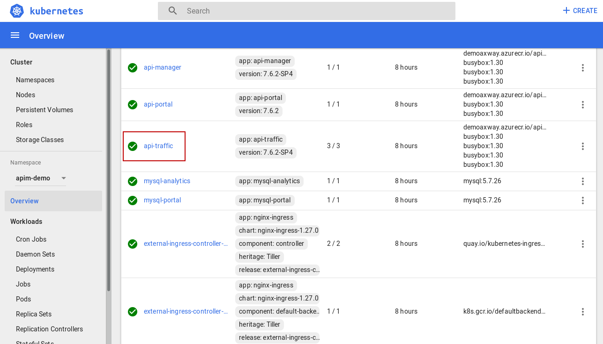
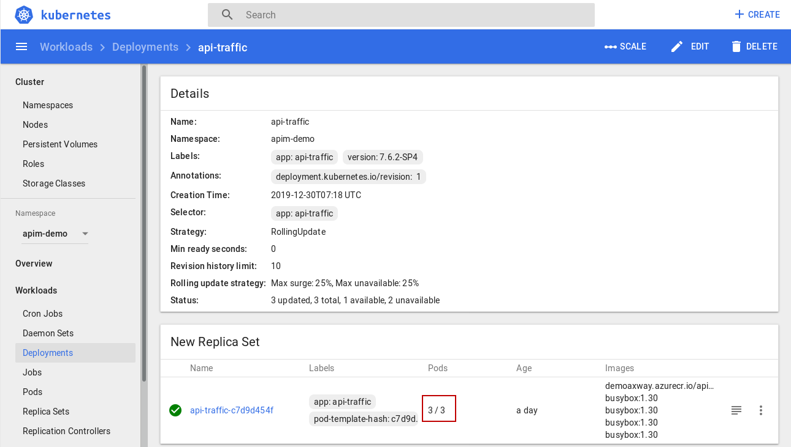
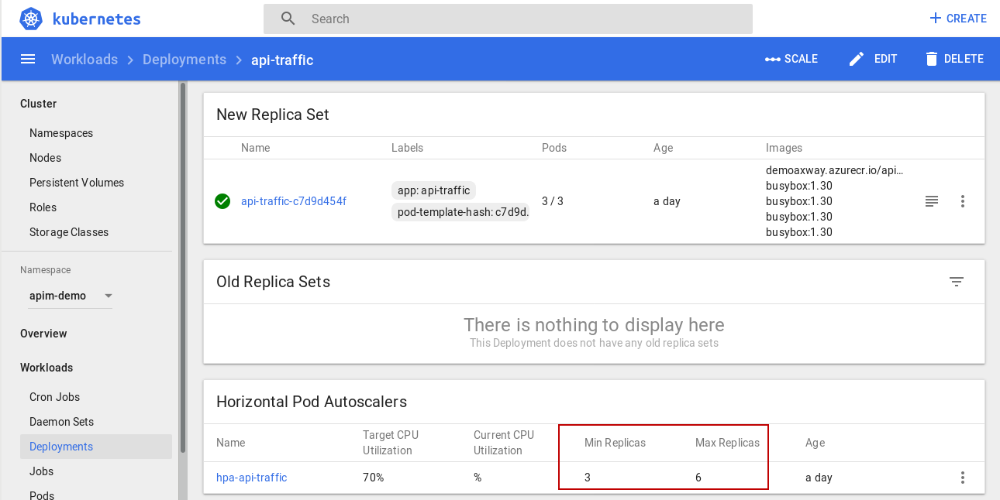
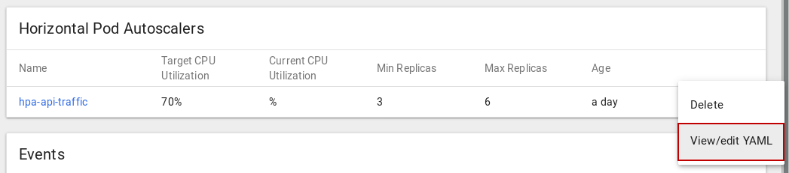
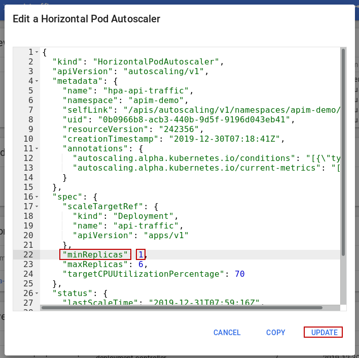
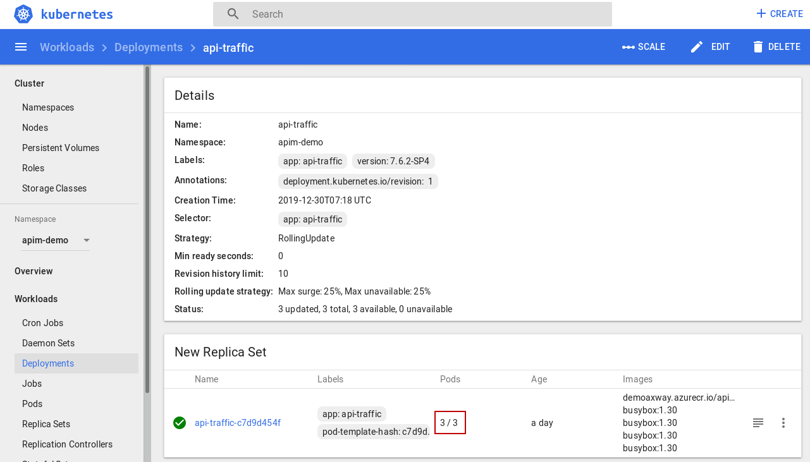
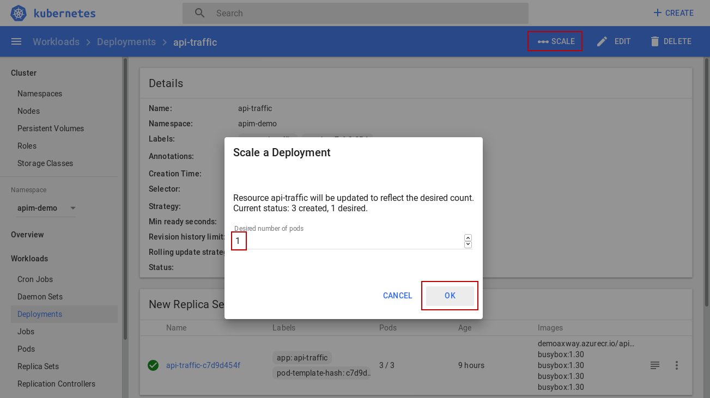
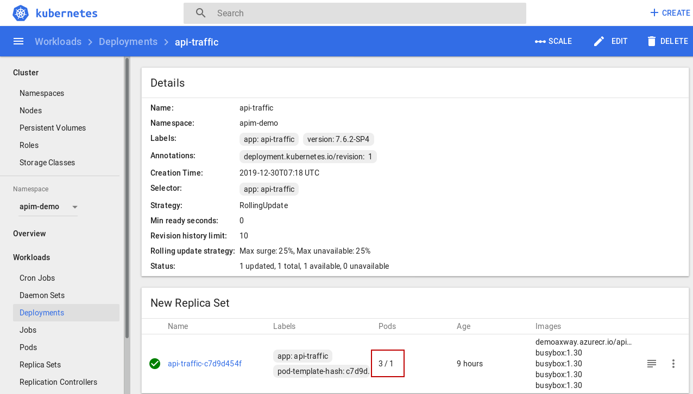
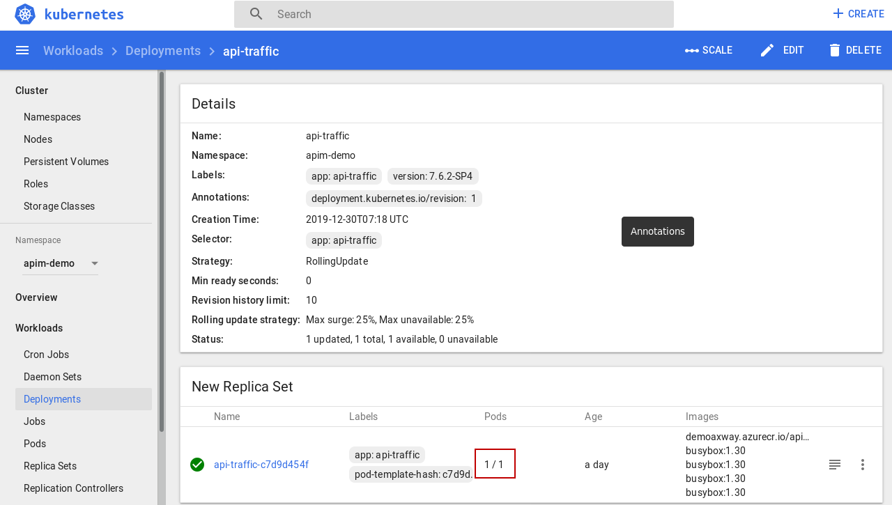

## Elasticity

Elasticity is the capability of a system to provision and de-provision resources automatically.

In next chapter we will see auto-scaling, and the capability to add more resources. So let's prove here elasticy the other way: reducing the number of resources.

Let's go to Kubernetes Dashboard and select api-traffic deployment.

Let's look at api-traffic configuration. There is currently 3 replicas on 3 expected. Another way to say it is we have 3 API Gateway instances working.

Let's scroll down to **"Horizontal Pods Autoscalers"**. As name stands, this is the configuration for auto-scaling. 

We can see minimum is 3. It is meant for high availability. For our demonstration, we need to allow 1 minimum.
- Expand the right menu and select **"View/edit YAML"**

- Set **"minReplicas"** to 1
- Click **"UPDATE"**

If you take a look, nothing changes for the replicas. 

Because 3 is still between 1 and 6. If we had try to scale down to 1 witthout this change, autoscaler would have put back to 3 replicas.

Once down, changing replicas is really straightforward:
- Click on **"Scale"**
- Change from **"3"** replicas to **"1"** replica
- Click **"OK"**  

Immediatly target replica changed.

Just a little later, 2 pods stopped and we reached target.

The same way, we could have scaled up. But let's the autoscaler do it for us!

**Next:** [Auto-scaling](../Auto-scaling)