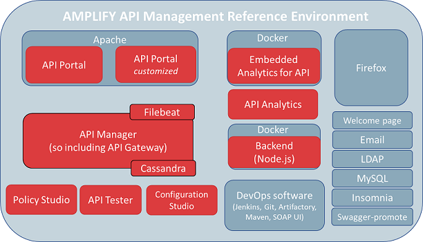
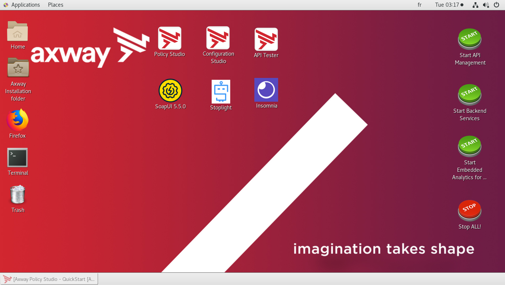
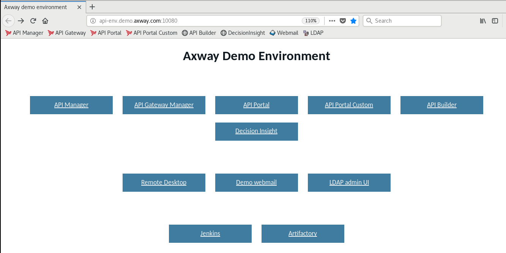
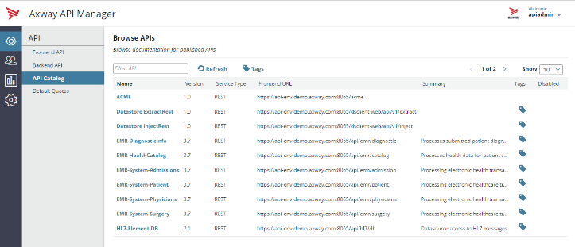
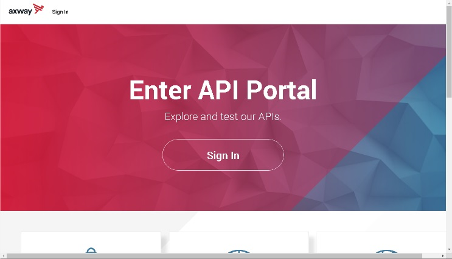
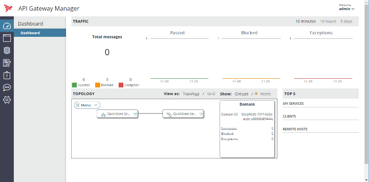
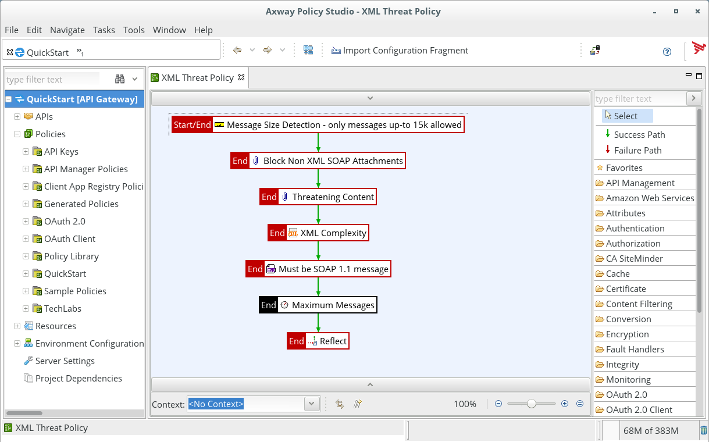

## APIM Reference Environment

All AMPLIFY API Management components are installed in this standalone virtual machine, and scenarios are provided.

APIM Reference Environment is generally used for enablement, workshop or as a sandbox. It can be downloaded by Axway partners from [Partner portal](https://axway.channeltivity.com/) or is provided by Axway people. It is not under the scope of Axway support. It is 
maintained and supported by the Digital Success Specialists (DSS).

A complete user guide is provided along the virtual machine. This section will focus on what you need for the scenarios. 

### Licenses

- For internal usage (Axway employees), the environment is delivered with valid internal licenses for API Gateway and Decision Insight.
- For external usage (partners or customers), ask your your Axway alliance/account manager for API Management and API analytics demonstration licenses (Not For Resale).

Place all the API Gateway licenses into this folder : 
/opt/Axway/APIM/apigateway/conf/licenses

Place the analytics license (the license with « analytics=1 ») into this folder : 
/opt/Axway/APIM/analytics/conf/licenses

Note : The analytics license allows to show monitoring dashboards in API Manager and API Portal.

 

### Access VM

Virtual machine is exported in VMware format. To use it:  
- run on your laptop: use VMware Workstation 12, or [VMware Player 7](https://my.vmware.com/web/vmware/free#desktop_end_user_computing/vmware_player/7_0) or above.
- run on a ESX (VMware infrastructure)

Virtual machine can be accessed
- with VMware desktop (from Workstation, or ESX)
- with terminal server (rdp). Use mstsc command on Windows or download a free rdp client on Mac
- with ssh, port 22 or 10022: for commandline

The recommended approach is to use VMware desktop, since everything you for the scenarios is inside the virtual machine.

#### User

Standard user is
- login: axway
- password: axway

Root user is
- login: root
- password: axway

Only axway user is required for scenario. Use root priviledges in exceptional cases only.

#### Host

Virtual machine hostname is:
- short: api-env
- long: api-env.demo.axway.com 

All APIM web UI can be accessed from the VM with this hostname. VM /etc/hosts is updated automatically.
When accessing from a remote location, like computer host, it is advised to edit /etc/hosts or C:\Windows\System32\drivers\etc\hosts and add these entries.

All shortcuts in the VM refer to the long name. If short name or IP is used, a TLS warning will occur.

### Desktop

There are 3 zones 
- At the left, there are VM tools. Firefox web browser and Terminal are espcially useful.
- In the middle, are the desktop tools. Policy Studio is the most important.
- At the right are shortcut to manage products

Firefox opens with a landing page, providing access to all web UI. There is also a shortcut bar.

Web UI requires still the servers to be started

### Products management

By default, product are stopped.

To start and stop products, they are links on the dekstop on the right side. Please use 
- Start API Management
- Start Backend services

It is also possible to use commandline:
- startAPIM / stopAPIM / statusAPIM: start / stop / status for APIM core components
- startBackend / stopBackend / statusBackend: start / stop / status for backend mockup used in scenarios 
- statusAll / stopAll: status / stop for all components (note: there is no start)

There are other components, like Jenkins or Artifactory, but they are used in advanced scenarios.

### Components

Web UI links are all accessible from Firefox home page, http://api-env.demo.axway.com:10080/.

#### API Manager

API Manager is a web-based interface that enables an API owner to easily virtualize APIs, manage their life cycle and manage consumer access. 
- URL: https://api-env.demo.axway.com:8075
- User / Password: apiadmin / changeme
- Traffic URL: https://api-env.demo.axway.com:8065

#### API Portal

API Portal is a highly customizable interface dedicated to consumer. It provides access to API Catalog, access self-service and monitoring capabilities.
- URL: https://api-env.demo.axway.com
- User / Password: dave / dave

#### API Gateway Manager

API Gateway Manager is a web interface to monitor activity of instances.
- URL: https://api-env.demo.axway.com:8090 
- User / Password: admin / changeme

#### Policy Studio

Policy Studio provides a development environment, which enables policy developers to develop many use cases like Restification, API orchestration, security policy or ESB integration. 

Launch from VM desktop or download package and install it on your laptop (select only Policy Studio option)
Deployment parameters:
- URL: https://api-env.demo.axway.com:8090
- User: admin
- Password:  changeme
- Passphrase: (empty)

#### Default Service

Default service is a HTTP listener, used to run Policies directly.  
- URL: http://api-env.demo.axway.com:8080
or
- URL: https://api-env.demo.axway.com:8443

#### Backend

Backend is a small node.js application, providing very simple mockup.
Backend base url is http://backend:5080. Different services are used by the scenarios.
