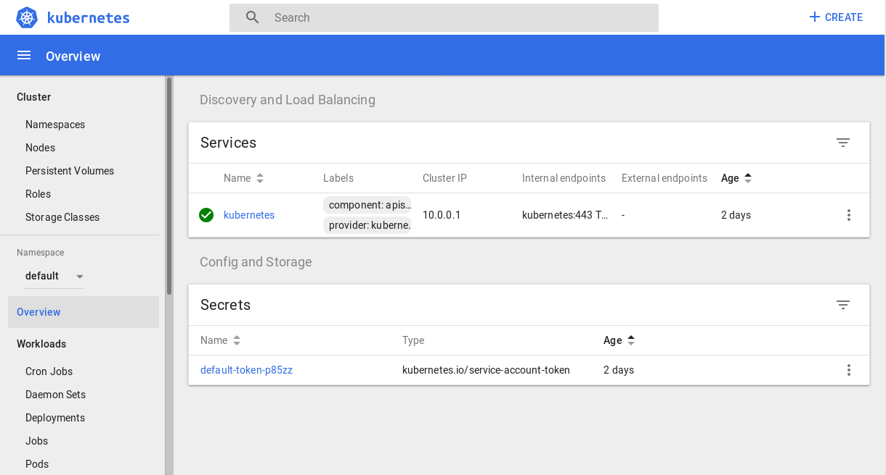
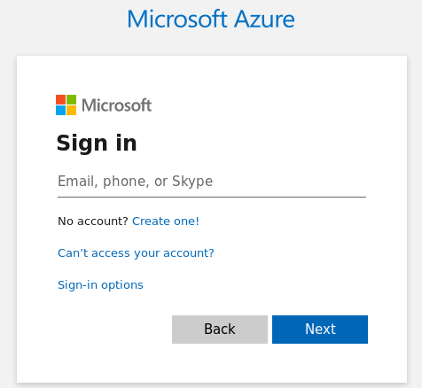
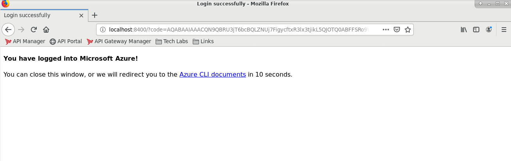
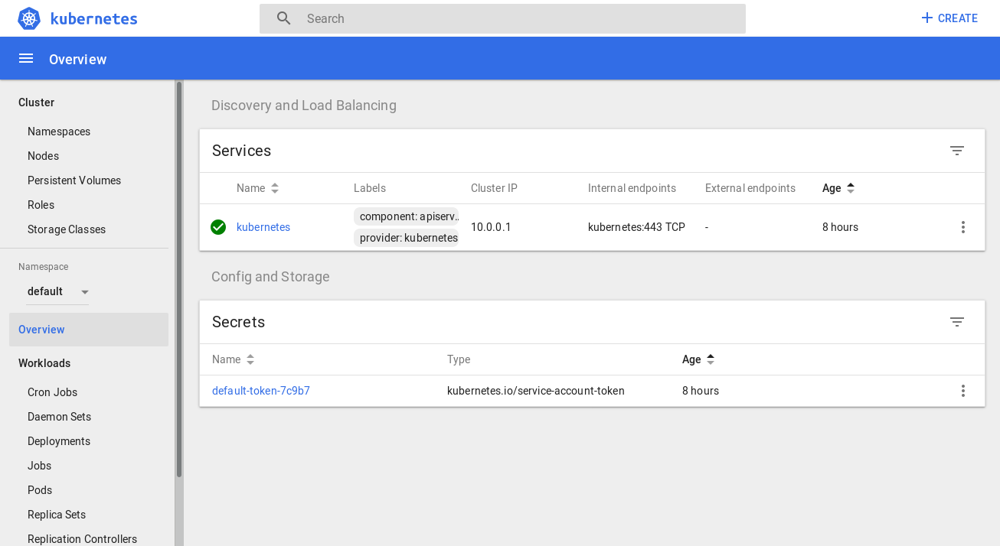
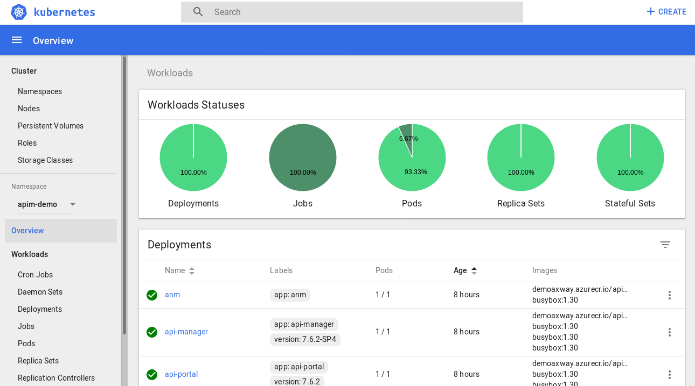
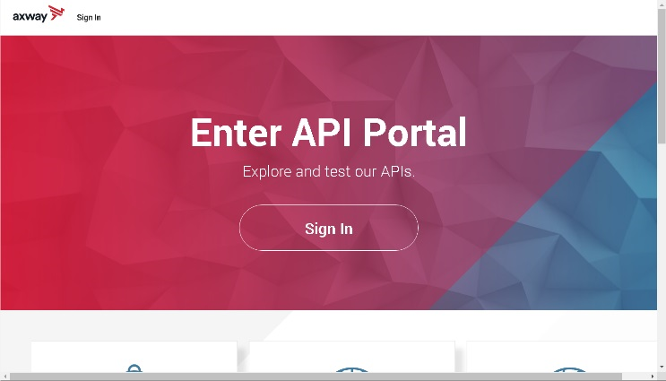
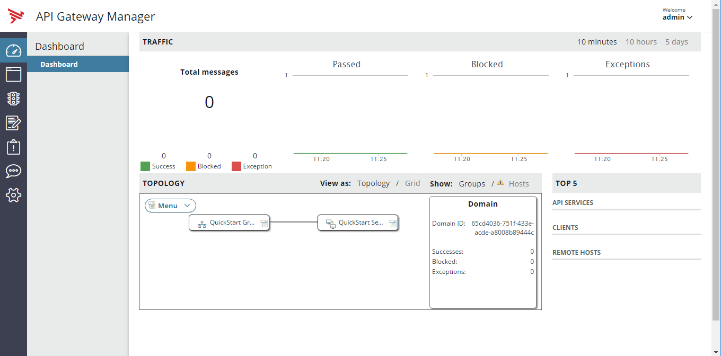
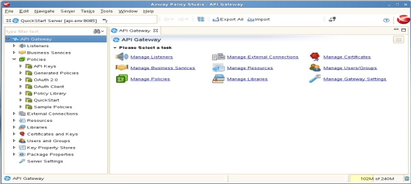

## Azure marketplace demo

AMPLIFY API Management can be deployed from Azure marketplace demo to AKS. Following components are deployed. 


Along with these components, there are scenarios designed to handle quickly the Axway solution.

Purpose of this section is to explain briefly how to use this environment for these scenarios. Along with the products deployement, there is a virtual machine, the bastion, already deployed. Just connect to the bastion to get an environment ready for the scenarios.

### Access the environment

AKS cluster can be managed using the standard Azure CLI. 
AMPLIFY API Management web UIs can be accessed with web browsers from the Internet. API traffic from the cluster or the Internet can be processed.
Policy design requires a thick client, Policy Studio.

Everything is already setup in the bastion
- Azure CLI and git installed
- Firefox with all web links
- Policy Studio installed

Scenario are designed to be played easily from the bastion. So it is advised to connect to it first when you start.

#### Access the bastion

First, you need to get the IP of your bastion.
**GET ACCESS TO BASTION**
Go to your Azure subscription, resource group, bastion VM, get IP
1. Connect to Azure portal

2. Select the Resource Group used in the deployment

3. Select bastion vm

4. Get the IP


Now that you have the IP, you can connect using a rdp client. mstsc is provided by default in Windows OS. RDP client can be easily installed from Mac OS app store. 

Here is the example to connect from Windows.
1. Search for Remote desktop connection and launch it

2. Provide the IP

3. Get the login page


Standard user is axway. 
You know already the password! It is the one you defined in the deployment page.


#### User

It is recommended to use only the axway user.
sudo is possible, by providing axway user password.

Only axway user is required for scenarios. Use root priviledges in exceptional cases only.


### Desktop


At the left, there are folders link, Firefox web browser and Terminal.
In the center, there are :
- welcome.html: double-click it to open Firefox with a page, with links to all UI
- Policy Studio: double-click to open Policy Studio, an Eclipse-based IDE to design policies 
- Kubernets Dashboard: a convient way to access AKS Kubernetes dashboard

### AKS management

Tools are already configured in the bastion to manage the AKS cluster. It is recommended to use Kubernetes Dashboard. 

Kubernetes Dashboard is just a launcher for:
```
az aks browse --resource-group $AZ_RESOURCE_GROUP --name $AZ_CLUSTER_NAME
```



Please be careful of the namespace selected.

Command line tools are also configured:
- az: Azure command line interface. Use az aks to manage the cluster.
- kubectl: kubernetes command line interface
- helm: kubernetes package deployment  


### Products management

Products are deployed in AKS cluster. They are started by default.

#### Kubernetes Dashboard

Kubernetes Dashboard provide an administration GUI for all eployment in Kubernetes cluster.
The simplest way to access it is by clicking on **"Kubernetes dashboard"** link in bastion Desktop.

The first time, you need to login, with Azure credentials.


If login is successful, plese close the web browser


Kubernetes dashboard is then opened automatically. Please take care of the namespace chosen


Axway API Management is deployed in **"apim"** namespace



Kubernetes Dashboard link is in fact using this command
```
az aks browse --resource-group $AZ_RESOURCE_GROUP --name $AZ_CLUSTER_NAME
```

Note: Azure Kubernetes Dashboard has a short time to live. If UI is not responsive (ex: some panels are blanks), please stop and restart Kubernetes Dashboard.


Please refer to [AKS documentation](https://docs.microsoft.com/en-us/azure/aks/kubernetes-dashboard) if you wish more details.


### Components
DNS entries are provided for each compoment. Its form is **component**.**deployment**.**timestamp**.azure.demoaxway.com.
All URLs links are preconfigured in Firefox shortcuts and welcome page.

#### API Manager

API Manager is a web-based interface that enables an API owner to easily virtualize APIs, manage their life cycle and manage consumer access.
- UI: https://api-manager.**deployment**.**timestamp**.azure.demoaxway.com
- User / Password: apiadmin / changeme
- Traffic URL: https://api-traffic.**deployment**.**timestamp**.azure.demoaxway.com


#### API Portal

API Portal is a highly customizable interface dedicated to consumer. It provides access to API Catalog, access self-service and monitoring capabilities.
- URL: https://api-portal.**deployment**.**timestamp**.azure.demoaxway.com
- User / Password: dave / dave



#### API Gateway Manager

API Gateway Manager is a web interface to monitor activity of instances.
- URL: https://anm.**deployment**.**timestamp**.azure.demoaxway.com
- User / Password: admin / changeme



#### Policy Studio

Policy Studio provides a development environment, which enables policy developers to develop many use cases like Restification, API orchestration, security policy or ESB integration. 



Available in the bastion. There is a link in the Desktop to start it. Any Policy Studio on the same version can also be used.
Policy Deployment parameters:
- Host:port anm.**deployment**.**timestamp**.azure.demoaxway.com:443
- User: admin
- Password:  changeme
- Passphrase: (empty)

IMPORTANT NOTE:
On one side, Policy requires deployment.
On the other side, the solution was deployed in container mode. Configuration is embedded in the image. The standard workflow is to create a new image. But this capability is not provided in Azure marketplace demo deployment. 
It is possible to deploy configuration on running instances, so on containers. This feature is used for development.

Be aware that if containers are destroyed and recreated (typically changing replicas), image configuration is used. Configuration in Policy Studio must be redeployed.

#### Default Service

Default service is a HTTP listener, used to run Policies directly.  
- URL https://default.**deployment**.**timestamp**.azure.demoaxway.com:443

#### Backend

Backend is a small node.js application, providing very simple mockup.
Backend is located in same namespace as the solution. It is not accessible outside of AKS. Its base url is http://backend:5080. Different services are used by the scenarios.
