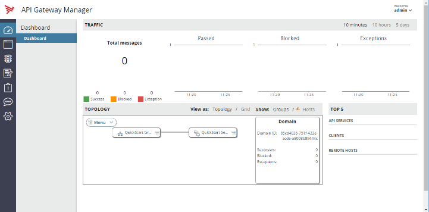

## The Digital Techlab Environment

### Components

Web UI links are all accessible from http://\<hostname\>:10080/ with the \<hostname\> provided by the techlab animator.

#### API Manager

API Manager is a web-based interface that enables an API owner to easily virtualize APIs, manage their life cycle and manage consumer access. 
- URL: https://\<hostname\>:8075
- User "apiadmin". The password is provided by the techlab animator.
- Traffic URL: https://\<hostname\>:8065

#### API Portal

API Portal is a highly customizable interface dedicated to consumer. It provides access to API Catalog, access self-service and monitoring capabilities.
- URL: https://\<hostname\>
- User "dave". The password is provided by the techlab animator.

#### API Gateway Manager

API Gateway Manager is a web interface to monitor activity of instances.
- URL: https://\<hostname\>:8090 
- User "admin". The password is provided by the techlab animator.

