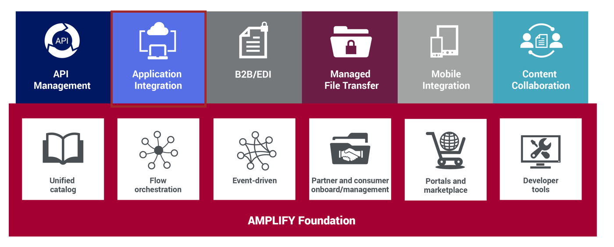
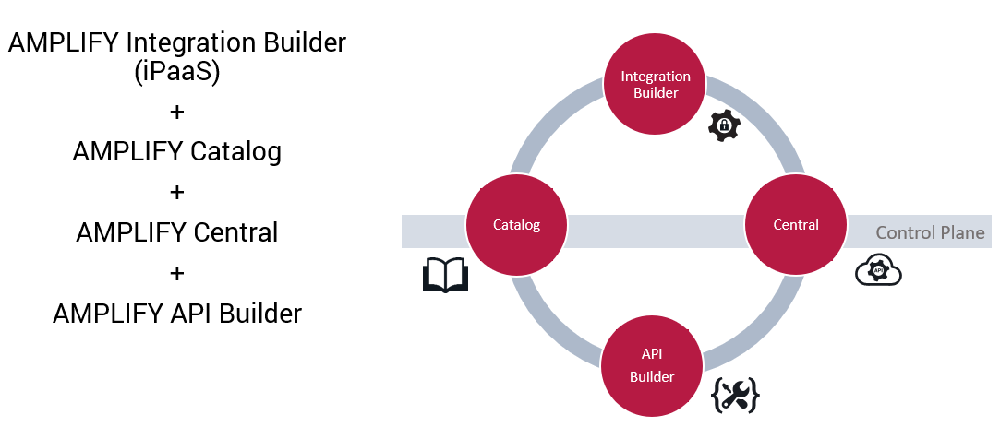

## 1. Application Integration - iPaaS

Before getting into the iPaaS exercise, let's have a quick introduction on Application Integration.

The AMPLIFY platform is the Axway **HIP** (**Hybrid Integration Platform**).

**The platform is the centralization of all the flows and integrations of your company : a unique API driven platform, with a unique user experience.**

**The iPaaS (Integration Platform as a Service) is the Application Integration module of the AMPLIFY platform.**

**AMPLIFY Application Integration** simplifies the building, deployment and management of integrations between (cloud) applications, including cloud-to-cloud, cloud-to-ground and ground-to-ground integrations. AMPLIFY Application Integration simplifies the process of integrating applications leveraging a number of Platform components including the following:
	

	
- **AMPLIFY Integration Builder**–*Connect and Integrate*.
	Integrate cloud applications easily. 150+ pre-built cloud connectors and powerful integration capabilities, with the ability to easily add your own, custom, connectors.
	
- **AMPLIFY Catalog**–*Publish and share*.
	A central, unified catalog for the discovery and reuse of integration services that include APIs, microservices, application integrations and traditional flows. Simplify and increase the speed of building, integrating and deployment of new services and apps. Facilitate and encourage self-service integration and co-creation.

- **AMPLIFY Central**–*Manage and Secure*.
	Manage your services and endpoints across multiple environments and clouds. Secure and manage access to your services.

- **AMPLIFY API Builder**–*Open up and integrate*.
	Make your legacy applications API ready and simplify the integration of these applications with other (cloud) applications. Build APIs and microservices in an on-premise or private cloud containerized environment. With API builder, you can unleash enterprise data for innovation with a wealth of (mobile-optimized) APIs, and the ability to easily create new ones.

Now let's see the demonstration use case.

**Next:** [Now let's see the demonstration use case.](../2.Demonstration_Use_Case)
