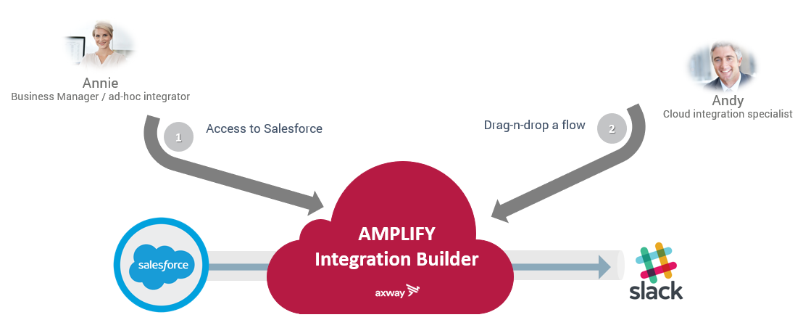

## 2. Demonstration use case

Annie, a business manager is working on getting new business for her company.
She wants to advertise her colleagues on Slack whenever she enters a new business opportunity in Salesforce. In this exercise, we will see how to easily set this up with the AMPLIFY platform.

First, we will see how to connect to Slack, Salesforce and AMPLIFY platform.

Then we will create instances of the out of the box connectors on the platform to connect to the cloud applications (Slack and Salesforce).

After this, we will create a flow to send Salesforce information to Slack.

And we will create a new instance of the flow, to link connectors to  flow instances.

Finally, we will test the demonstration.

**Next:** [Let's start with testing the connection to the interfaces Slack, Salesforce and AMPLIFY platform.](../3.Connect_to_interfaces)