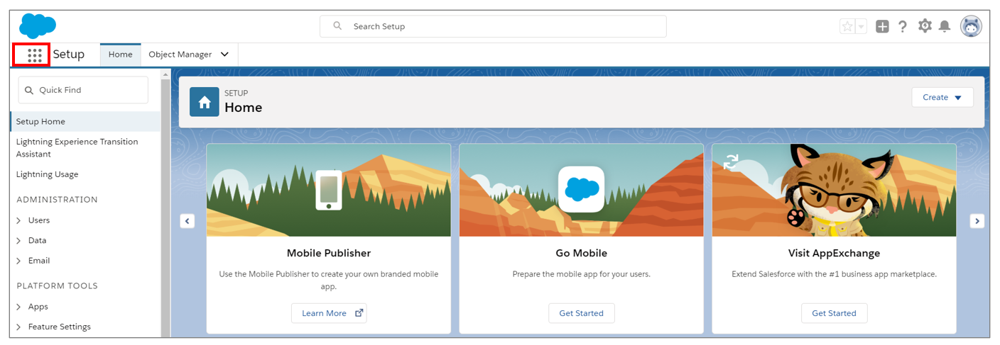
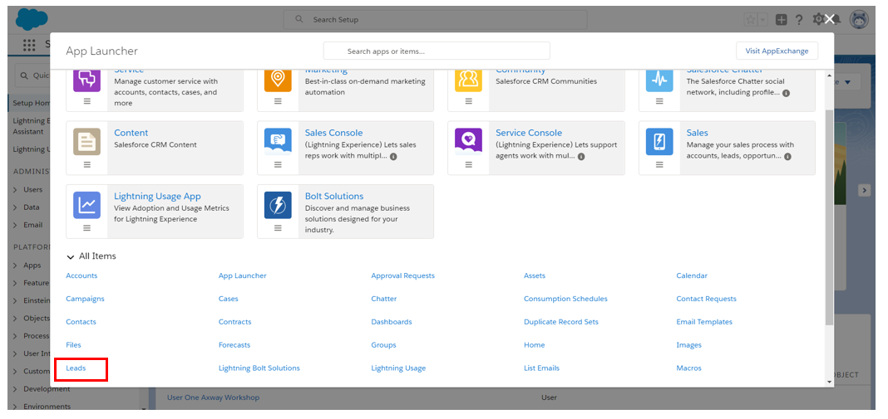
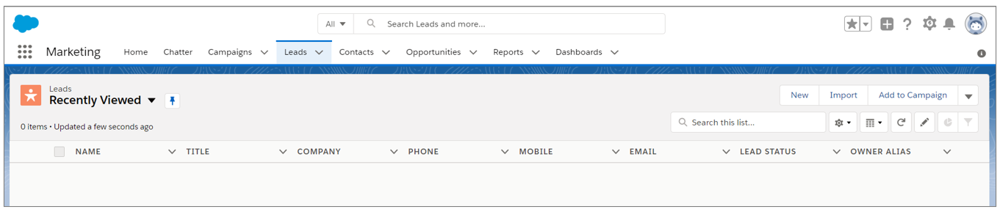
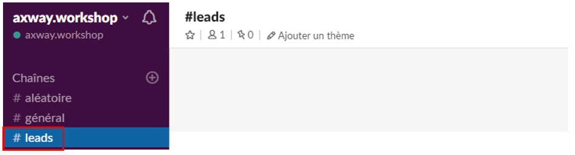
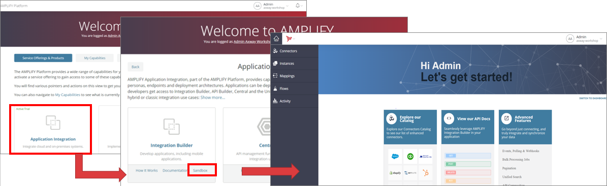

## 3. Connect to interfaces

Connect to Salesforce, Slack and the AMPLIFY platform in a browser.
You can either create accounts, or use the ones given by your animator.

### Connect to Salesforce
- If you want to create your Salesforce account, choose a developer account on https://developer.salesforce.com/signup
- Connect to the URL: https://login.salesforce.com
- Click on the menu

- Click on **"Leads"**

- You will access to the Leads creation page

	
### Connect to Slack
- Connect to the URL: https://axwayworkshop.slack.com
- If you have created your own account, create a workplace and a channel leads.
- Open **“leads”** channel

### Connect to AMPLIFY Platform
Connect to AMPLIFY Application Integration
- Connect to the URL: https://platform.axway.com
- To create you own account, click on "Get started for free". Then in the Application Integration tile, click on "Start Free Trial".
- Click on **“Application Integration”**
- In “Integration Builder, click on **“Sandbox”**

**Next:** [Now let's create instances of the cloud connectors in the AMPLIFY platform.](../4.Instantiate_cloud_connectors)
