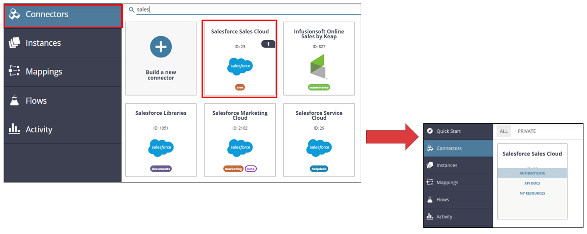
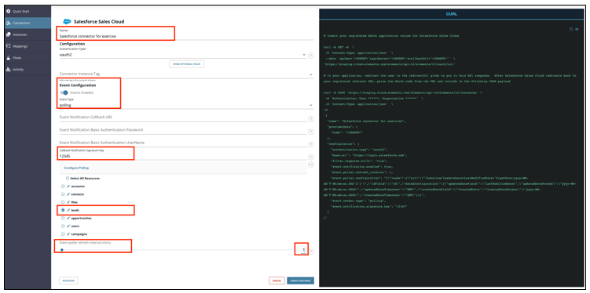
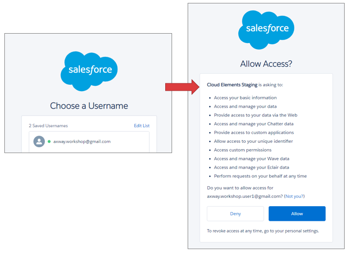
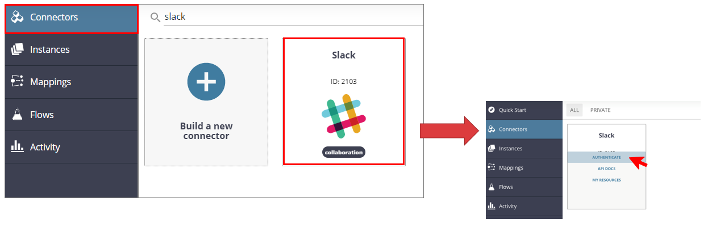
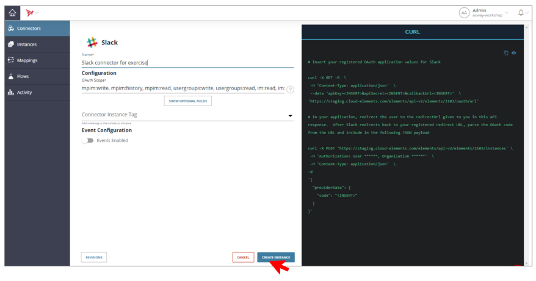
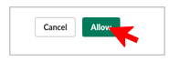
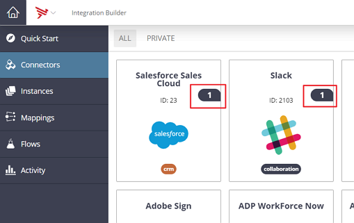

## 4. Instantiate cloud connectors
### Instantiate Salesforce connector
- In Integration Builder, access to **“Connectors”**
- Find **"Salesforce Sales Cloud"** connector and click on **"Authenticate"**

Type the following values for the connector :
- Type a name for the connector instance : **"Salesforce connector for exercise"**
- Select **"Event Enabled"**.
- Select **"polling"** on Event Type.
- Type **"12345"** on Callback Notification Signature Key field.
- Select **"leads"** on objects to monitor for changes.
- Select **"1"** on the field Event poller refresh interval (mins)
- Click **"Create Instance"**

You are prompted to log on to Salesforce.
- Enter your Salesforce user name and password given by your animator
- Click on **"Allow"**
- Return to Application Integration.

### Instantiate Slack connector
- Access to **“Connectors”**
- Find **"Slack"** connector and click on **"Authenticate"**

- Type a name for the connector instance, **"Slack connector for exercise"**
- Click on **"Create Instance"**

- You are prompted to authorize Slack.
- Click **"Authorize"**.

- Return to Application Integration.
- Check that the two instances Salesforce and Slack are correctly created on Connectors : a ‘1’ should appears near the connector, indicating that a new instance has been defined

**Next:** [Now, let's create a cloud2cloud flow](../5.Create_Cloud2Cloud_flow)

