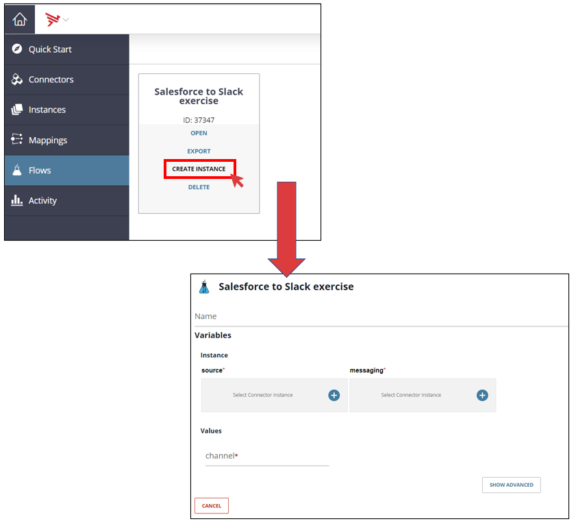
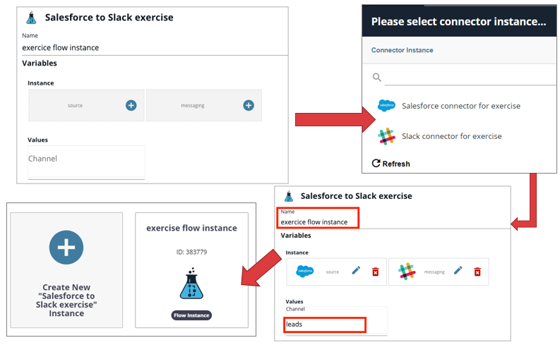

## 6. Instantiate Cloud2Cloud flow

- Click on **"Flows"** tab
- Place the cursor over the **"Salesforce to Slack exercise"** flow
- Click on **"Create Instance"**
- Three variables tiles are displayed. These are the variables you created earlier. 

- Type a name for the flow instance : **"exercise flow instance"**
- Select the connectors :
    - Source = **Salesforce**
    - Messaging = **Slack**
    - Channel = **leads**
- Click on **"Create Instance"**
- The new flow instance is created

**Next:** [And finally, let's test our new Salesforce to Slack integration!](../7.Test_demonstration)