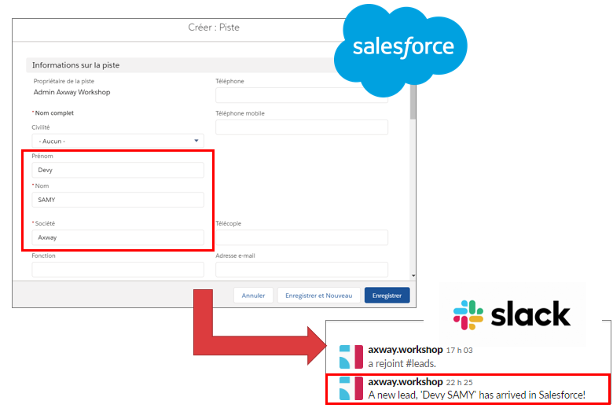
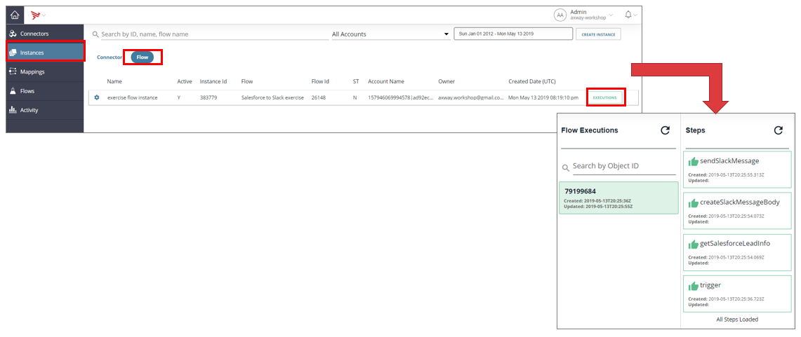

## 7. Test demonstration

### Salesforce
- Click on **"Leads"** > **"New"**
- Indicates the Firstname and Lastname on the Lead, the the Society. Click on **"Save"**.
	
### Slack
- Check that the notification appears on the «leads» channel.
- The notification can take 1 minute to be generated.

You can monitor the flow execution in Application Integration:
-  Click **"Instances"**.
- Click **"Flow"**.
- Find the flow instance in the list and click **" Executions"**.
- Click an object ID tile to reveal execution step tiles.
On the following screenshots, you see all the steps as the monitoring has been enabled.

Now Annie can create leads in Salesforce and keep informed all her colleagues automatically. Sweet!

The exercice is finished. If you want to play around with AMPLIFY platform, you can also create your own account on the platform.

**Next:** [Create your AMPLIFY platform account](../8.Access_to_AMPLIFY_Platform)
