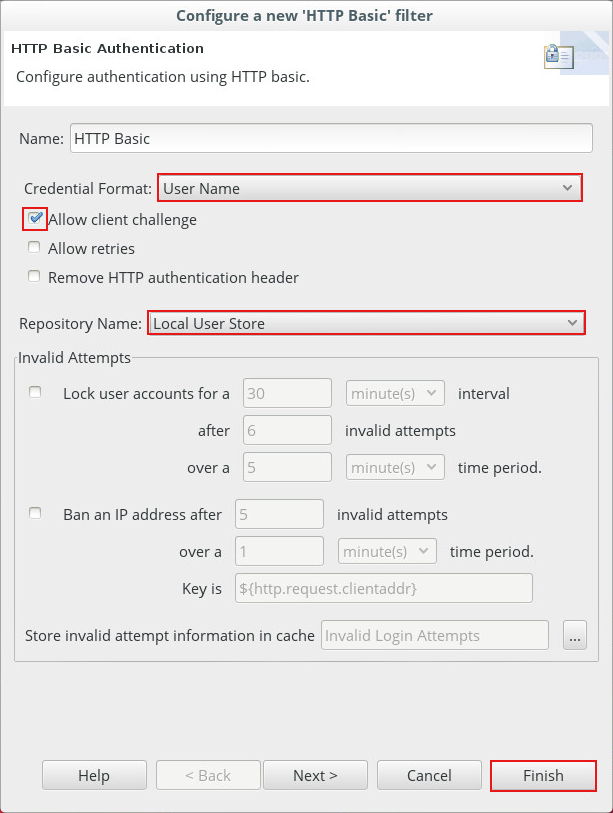

## User authentication

In this scenario, we will modify the behavior of the previously-created policy: 
- If the user is not recognized by the API Gateway platform, the quotas rule is applied automatically.
- Otherwise the quotas rule is not applied.
This is the policy that you are going to implement:

### New **"Authentication"** policy
We are going to isolate the identification part in an independent Policy. At the same time you will test the reuse of policies.
We are therefore going to create a new policy: **"Authentication"**. This policy will authenticate the user using basic authentication (use of an identifier / password pair) when logging in.
- Return to the **"Policy Studio"** interface (bottom menu)

- Right click on the **"TechLabs"** container in the Axway Policy Studio explorer, on the left-hand section of the interface.

- Then click on the **"Add Policy"** link 

In the window which appears, 
- For the **"Name"** field, enter **"Authentication"**

- Click on **"OK"**

The **"HTTP Basic"** filter is used to manage the basic user authentication.
- In the search zone, located at the top of the right-hand column, enter **"http"**
- Select the **"HTTP Basic"** filter
- Drag and drop this filter to the main frame

This filter authenticates a user with HTTP basic on many possible authentication repositories, like LDAP and Active Directory. In this scenario, we use the Gateway internal user store.
 
In the **"Configure 'http Basic'"** window, 
- Select the following in the respective fields:
  **Credential Format**: User Name
  **Repository Name**: Local User Store
- Leave the **"Allow client challenge"** option activated
- Click **"Finish"**.

- To define the start of the Policy, right-click on the **"HTTP Basic"** filter and select **"Set as Start"**.

So our authentication policy is only one filter!

 

### Evolution of the **"Quota System"** policy

Let's return to the **"Quota System"** policy and use this **"Authentication"** policy which has just been created.
- Click on the **"Quota System"** tab

- Select the **"Authentication"** policy in the explorer on the left.
- Drag and drop the **"Authentication"** policy to the canvas.

- In the **"Configure a new 'Policy Shortcut' filter"** window which appears, check that the **"Authentication"** policy is selected.
- Leave the default values and click **"Finish"**

We are now going to define the **"Call 'Authentication'"** filter as a new start filter.
- Right-click on the **"Call 'Authentication'"** filter and select **"Set as Start"** in the pop-up menu. 

- If the authentication succeeds, there are no limits to apply, and we therefore pass directly to the positive processing of the message. In the right-hand column, select the green **"Success Path"** arrow, corresponding to the correct execution of the filter 
- Click on the **"Call 'Authentication'"** filter to position the start of the arrow, then click on the **"Set message OK"** filter to indicate the end of the arrow.

- In the right-hand column, select the red **"Failure Path"** arrow
- Connect the **"Call 'Authentication'"** filter to the **"Throttling"** filter in the same way.

The final diagram should look similar to the following picture.

 
###	Deployment
The second version of the policy is now ready to be deployed
- Deploy the new configuration using the **"F6"** key on the keyboard.
- This is exactly the same step as previously (password changeme)

### Tests
Test is conceptually the same, but we need to authenticate
- In the browser, enter again the URL: **[Default Service url]**/TechLabs/quota

On the first request, the service returns an authentication request.
 
In the **"Authentication Required"** window,
- For the **"User Name"** field, enter **"user1"**
- For the **"Password"** field, enter **"axway"**
- Click **"OK"**

- Click several times on the web browser refresh button to simulate successive requests.
**Expected result**: Since the **"user1"** user is included in the list of users recognized by API Gateway, the **"Throttling"** filter does not apply to this user. Therefore, whatever the frequency of the requests, the acknowledgements returned will always be positive.

Test with an unrecognized user: test
- Close the browser and open it again to start a new session.
- In the Firefox browser, enter the URL: **[Default Service url]**/TechLabs/quota
- In the **"Authentication Required"** window, enter the following in the respective fields:
  **User Name**: test
  **Password**: test
- Then click on **"OK"** button

- Click several times on the web browser refresh button to simulate successive requests.

**Expected result**: Since the **"test"** user is not included in the list of users recognized by API Gateway, the **"Throttling"** filter therefore applies to this user in the same way as in the previous exercise. The service returns one positive response per 5 second period, successive requests during this period will be rejected.

### Monitoring
- If necessary, re-open a web browser tab to **"API Gateway Manager"**:
- If authentication is requested, enter:
**User Name**: admin
**Password**: changeme
- Then click on **"OK"** button

We obtain three types of messages:
- Messages passed
- Messages failed
- Messages caused an exception

- Click on the **"Traffic"** tab, the activity of the server is displayed.

- Select a line for which the **"status"** of the request is **"500 Internal Server Error", by clicking on it.
It is possible to consult the progress of the policy which has been implemented:
1.	Authentication with the **"test"** user: failed
2.	Application of the **"Throttling"** filter: quota exceeded
3.	Result of the request: **Access to service denied*.
- In the lower part of the page, you can find the HTTP request and response information and the messages from a trace file that correspond to the failed request. Your screen should look similar to this one:

- Click on **"Back"** to return to the list of traffic
- Click a line with the **"status"** of the request equal to **"401 Authentication Required".

This result corresponds to the messages for which the request has generated a **"Messages caused an exception"** exception. 
An exception has been raised since the request sent by the browser to API Gateway did not have the username / password identification elements.
This behavior is identified: during the first request, the **"Quota System"** policy is run twice:
1.	Through the web browser, we request our policy exposed through **"/TechLabs/quota"** path, the **"HTTP Basic"** filter reports the need for a login and a password. The policy ends by raising an exception.
2.	The **"Allow client challenge"** option, checked by default in the **"HTTP Basic"** filter, authorizes our web browser to offer the default connection window. Once login and password is entered, the policy is run a second time with the identification data.

**Next:** [Let's add group and quota management](../Group_membership_quota_policy)
