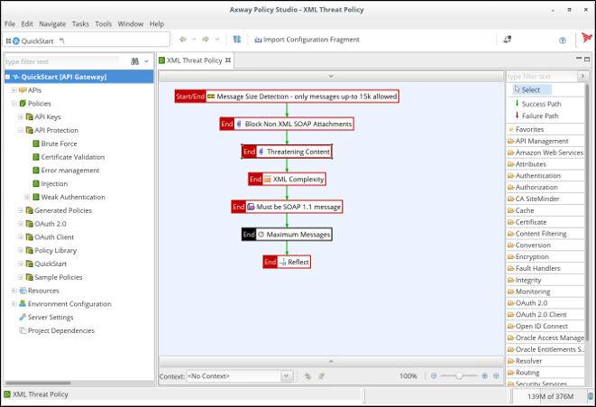
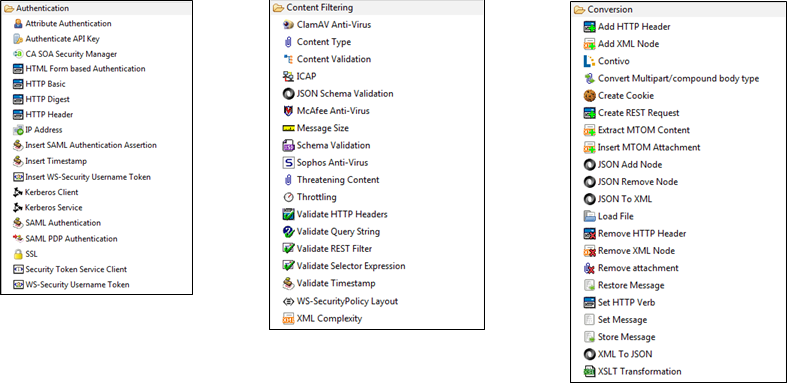
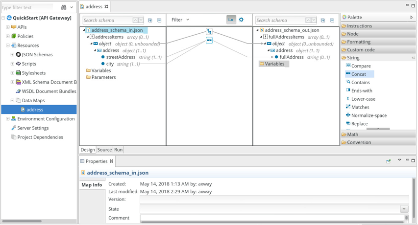

Policy Studio is an Eclipse-based IDE, used to create Policy object. Policies will handle all your needs in Identity mediation, Threat protection and integration.

Example of typical use of policies:
- Threat protection policy (DOS/DDOS, Injection, XML Bomb, ...)
- REST to SOAP transformation
- API orchestration/mashup/aggregation
- OAuth 2.0/OpendID Connect client, server and Authorization server. Provided as policy so entirely customizable
- Identity token mediation (ex: OAuth 2.0/SAML)  

As an example, here is a XML threat protection policy.

In the center, the policy, at the 
A Policy is a graph of steps, called Filters. It is created by drag and drop on Filter from the right panel. With more than 200 filters, it is capable of a lot of things! 

Here is the content under some filter menus:

Some examples of technical capabilities:
- protection: API Firewalling, Throttling, size, XML complexity, ...
- protocol: HTTP(S), JMS, SFTP/FTP(S), pop3, file scanning, scheduler, ...
- connector: LDAP, JDBC, ICAP, SMTP, Syslog, CA SiteMinder, Oracle Access Manager, ...
- data manipulation: XML and JSON path manipulation and schema validation, visual mapper, ...
- security protocols: HTTP Basic, API Key, OAuth 2.0, Open ID Connect, SAML, WS-Security, STS, Kerberos, ...
- other: cache, key property store, embedded queuer, ... 

It also includes a visual mapper.

**Next:** [Let's prepare our environment](../Preparation)
