## Restriction based on the group
The objective is to develop the policy to take into account three levels of authorization for access to the services:
- "Gold" level: Unlimited access;
- "Silver" level: Access limited to 5 requests every 5 seconds;
- "Bronze" level: 1 request every 5 seconds, default right for an unrecognized user.

Let's go to the **"Policy Studio"** and open the **"Quota System"** policy.
Here are the new elements of the policy (*on the light background*) that you are going to implement:
 
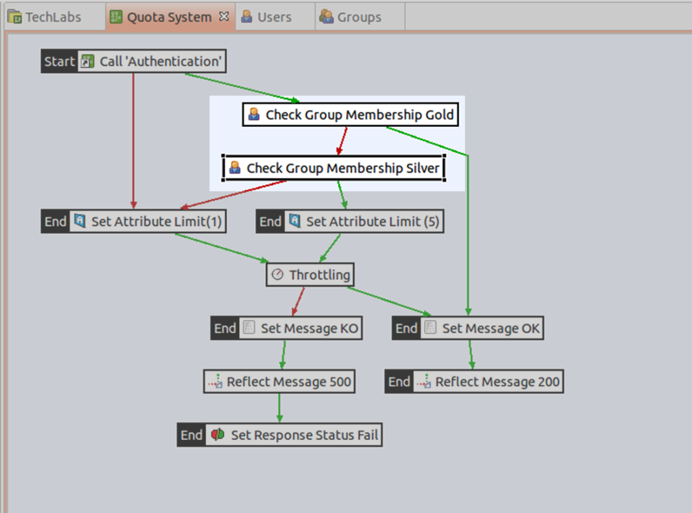

### Modification of the "Quota System" policy
Following authentication, once the user is identified, their group must be determined. The **"Check Group Membership"** filter is used to check whether a user belongs to a certain group.
- In the search zone, located at the top of the right-hand column, enter **"check"**.
- Click on the **"Check Group Membership"** filter
- Then click on the green arrow connecting the **"Call 'Authentication'"** filter to the **"Set Message OK"** filter
- The "Check Group Membership" filter will then be inserted on the selected arrow.
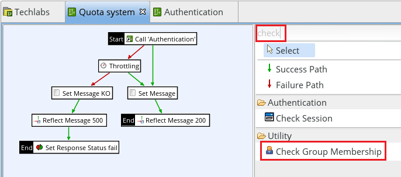
 
In the "Configure a new 'Check Group Membership' filter" window, 
- For the "Name" field, enter "Check Group Membership Gold"
- For the "User" field, leave the pre-configured value.
- For the "Group" field, enter "Gold"
- Click "Finish"

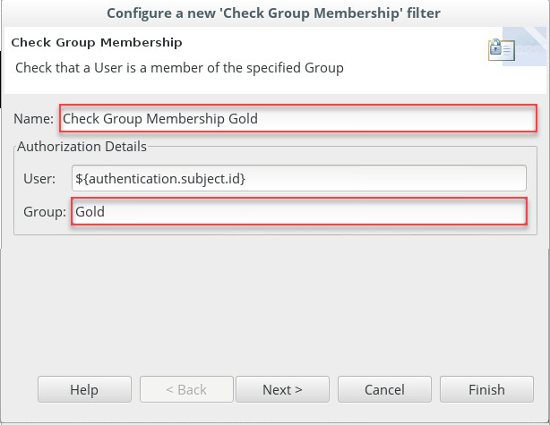

- Select the **"Check Group Membership"** filter.
- Drag and drop this filter to the "Check Group Membership Gold" filter created previously. This will create an error management branch (red arrow).
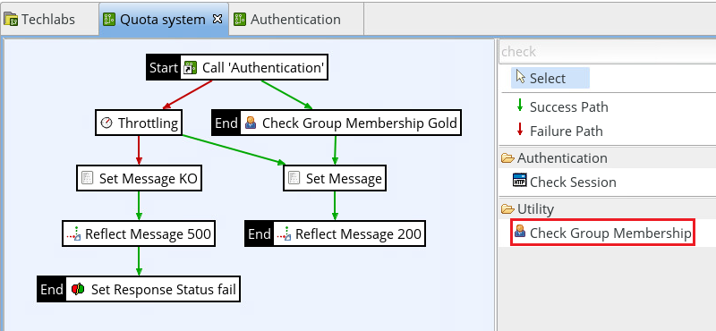
 
In the "Configure a new 'Check Group Membership' filter" window, 
- For the "Name" field, enter "Check Group Membership Silver"
- For the "User" field, leave the pre-configured value.
- For the "Group" field, enter "Silver"
- Click "Finish"

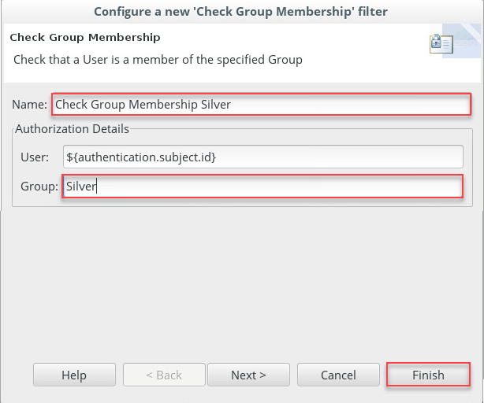

In the search zone, located at the top of the right-hand column, enter "set".
- Select the "Set Attribute Filter" filter.
- Drag and drop this filter to the "Check Group Membership Silver" filter.

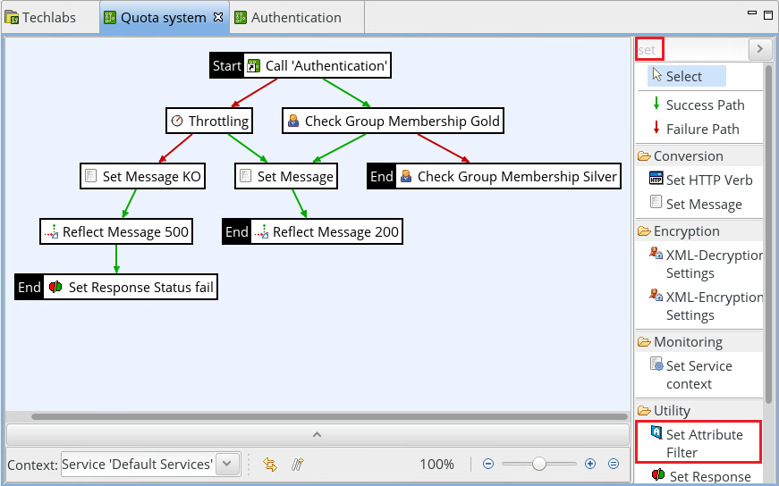
 
The "Set Attribute Filter" filter is used to assign a value to a variable. Here we will allocate the value corresponding to the maximum number of transactions authorized per unit of time. In the "Configure a new 'Set Attribute Filter' filter" window:
- For the "Name" field, enter "Set Attribute Limit (5)"
- For the "Attribute Name" field, enter "Limit" (be sure to respect upper/lower case)
- For the "Attribute Value" field, enter "5"
- Click on "Finish"

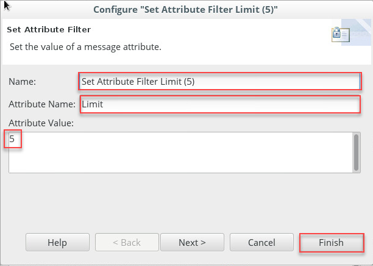

- Select the "Set Attribute Filter" filter
- Drag and drop this filter to the "Check Group Membership Silver" filter. This will create an error management branch (red arrow). If the requester identified does not belong to the Silver group, they form part of the Bronze group and are entitled to one request every 5 seconds.

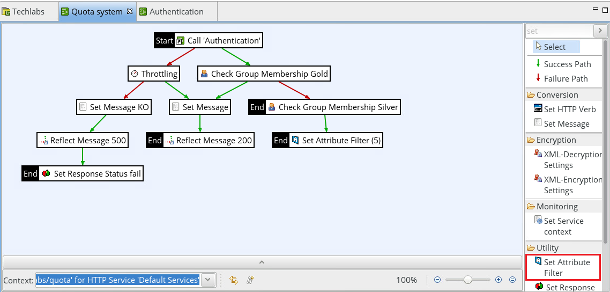
 

In the "Configure a new 'Set Attribute Filter' filter" window, 
- For the "Name" field, enter "Set Attribute Limit (1)"
- For the "Attribute Name" field, enter "Limit" (be sure to respect upper/lower case)
- For the "Attribute Value" field, enter "1"
- Click "Finish".

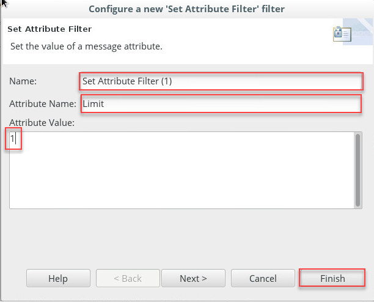

- Select the green "Success Path" arrow.
- Connect the "Set Attribute Filter (1)" filter to the "Throttling" filter.

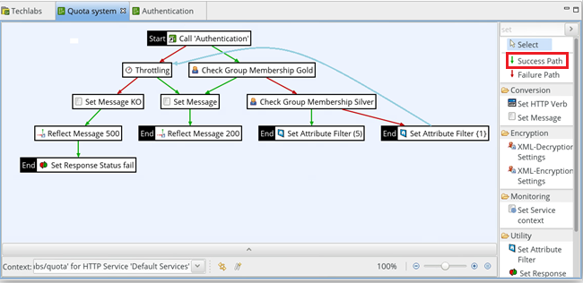
 
- Select the green "Success Path" arrow.
- Connect the "Set Attribute Filter Limit (5)" filter to the "Throttling" filter.

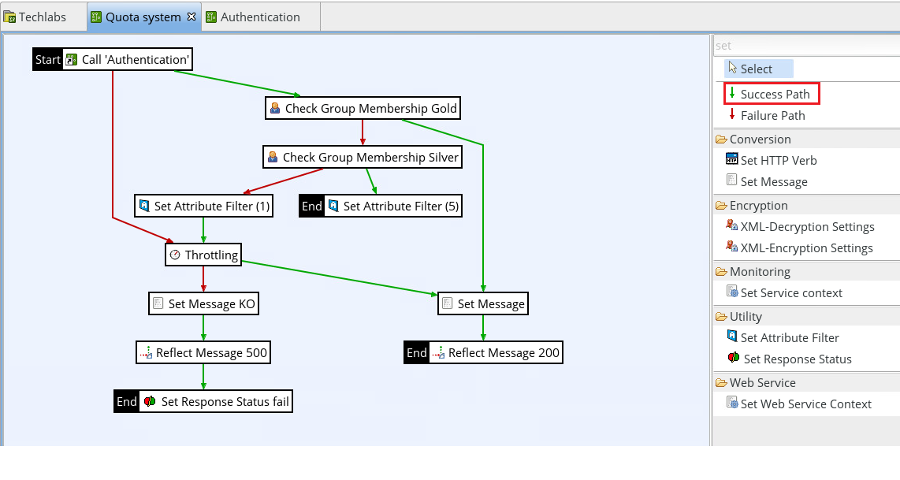
 
- Click at the top of the right-hand column on "Select" to be able to select filters on the main frame.
- Double-click on the "Throttling" filter to open its properties window.
- In the "Configure "Throttling"" window, change the value of the "Allow" field to "${Limit}" (be sure to respect upper/lower case).
- Click on "Finish".

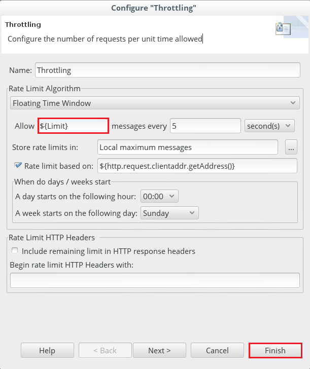
 
You will move the red **"Failure Path"** arrow, which starts from the **"Call 'Authentication'"** filter, to connect it to the **"Set Attribute Filter (1)"** filter.

To do this:
- Click on the red arrow connecting "Call 'Authentication'" and "Throttling".
- Its two ends show small black squares.
- Select the end with the arrow, and move it to the "Set Attribute Limit (1)" filter
- Your policy should look like this:

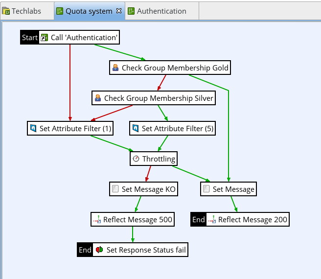

 
### Deployment
The policy is now ready to be deployed.
- Press the "F6" key (password changeme).
- Click on the "Finish" button once the deployment is completed.

### Tests
We want to test the policy with different users, belonging to different groups. Setup was already done in the reference environment. You can take a look of it here :
- The list of users:

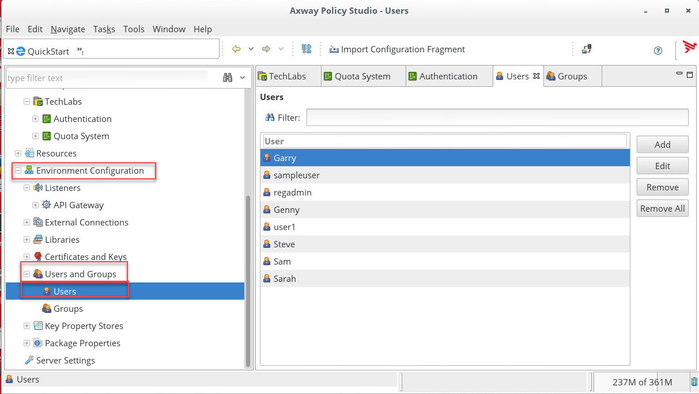

- The list of groups:

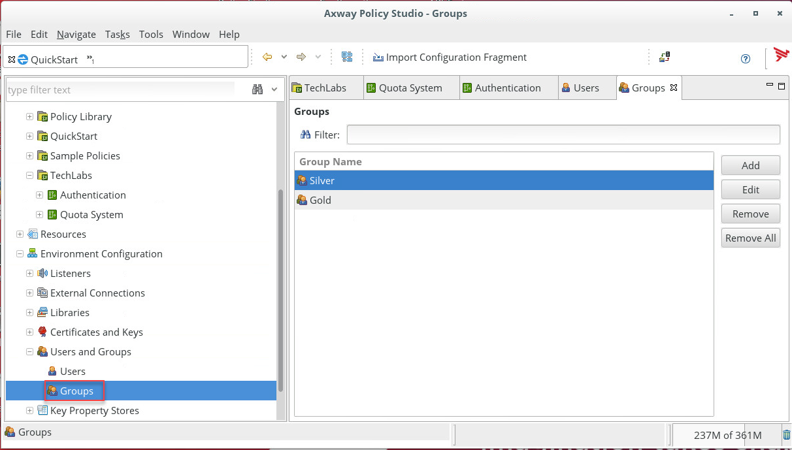

- The following users are part of the "Gold" group:

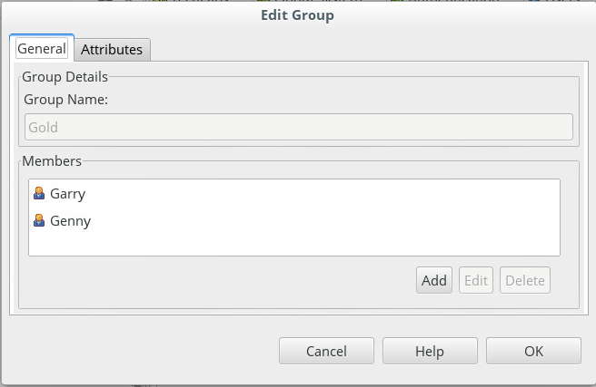

- The following users are part of the "Silver" group:

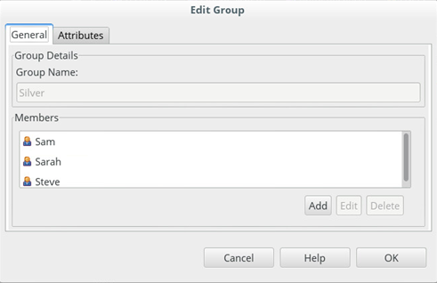
 
Let's test with different user. Web browser can remind identity you put, so do not easy to open a new private tab or close and reopne the browser.

- Enter once again the URL: **[Default Service url]**/TechLabs/quota
- On the first request, the service returns an authentication request.
- In the "Authentication Required" window, enter the following in the respective fields: 
**User Name**: Garry (with two “r”)
**Password**: axway
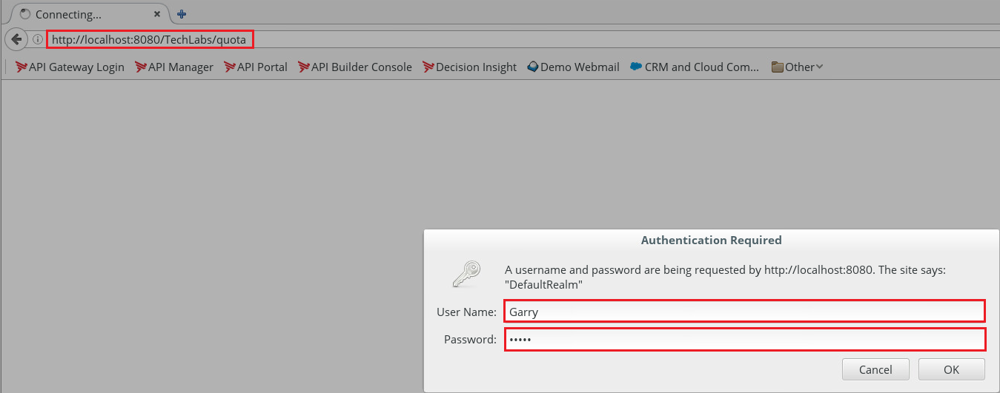
 
- Then click "OK"
- Press the "F5" button several times to send successive requests.

**Expected result**: Since the user "Garry" belongs to the "Gold" group, the "Throttling" filter does not apply. Therefore, whatever the frequency with which requests are sent, positive responses will always be returned.

- Exit the browser to reset the cache, and open a new session.
- In the browser, enter once again the URL: **[Default Service url]**/TechLabs/quota
- In the "Authentication Required" window, enter the following in the respective fields:
**User Name**: Sarah
**Password**: axway
- Press the "F5" button several times to send successive requests.
**Expected result**: Since the user "Sarah" belongs to the "Silver" group, the "Throttling" filter applies with the limit of 5 requests authorized per 5 second period. Therefore, if requests are sent more frequently than this, the responses returned will be negative.

- Exit the browser to reset the cache, and open a new session.
- In the "Authentication Required" window, enter the following in the respective fields: 
User Name: user1
Password: axway
- Then click "OK"
Expected result: The "user1" user does not belong to the groups with privileges. They are only entitled to one request per 5 second period.

### Monitoring
- Run the "Firefox" browser if necessary and open the "API Gateway Manager" by clicking on the corresponding link:
- If authentication is requested, enter:
**User Name**: admin
**Password**: changeme
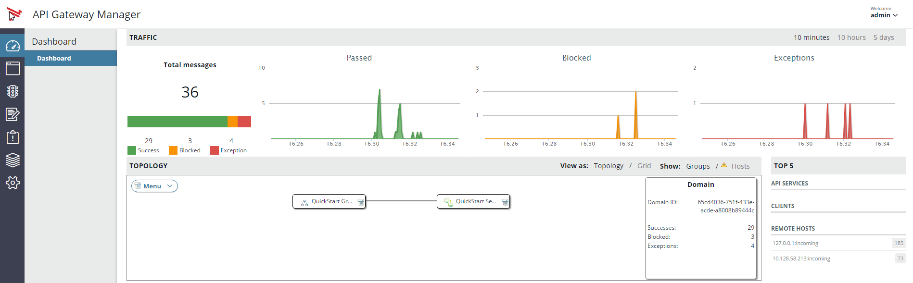

- Click on the green graph, for “Passed” transactions. 
Select a transaction in the list with subject “Garry”, for the user Garry. He is a "Gold" subscriber, all responses are positive :
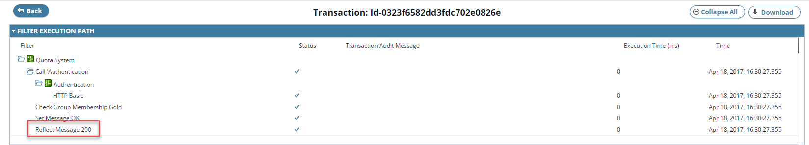

 
Delete the filter “Transaction status” to see all transactions. 
Select a transaction in the list with subject “Sarah”, for the user Sarah. She is a "Silver" subscriber, response is negative when more than 5 requests have been submitted in the authorized time period:
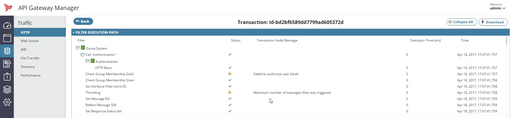

Select a transaction in the list with subject “user1”, for the user1. He is not a subscriber, response is negative when more than 1 request has been submitted in the authorized time period:
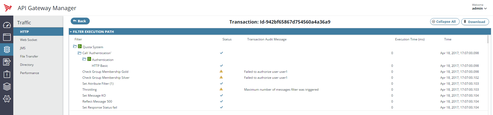

Select a transaction in the list with subject “test”, for the user test. He is an unknown user, response is negative when more than 1 request has been submitted in the authorized time period :
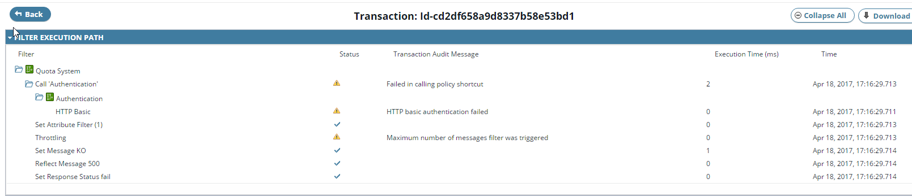
 
- Go to the "Traffic" tab, select an element corresponding to a test with the "user1" user and for which the result has raised an exception.
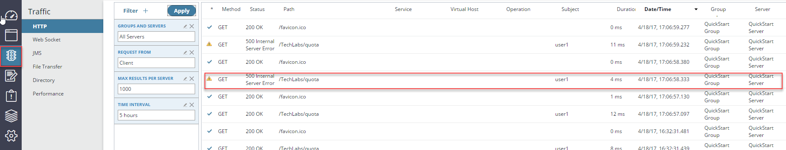

It is possible to consult the progress of the application of the policy which has been implemented:
1. The result of the "Check Group Membership Gold" filter : failed
2. The result of the "Check Group Membership Silver" filter : failed
3. Application of the "Throttling" filter : quota exceeded
4. Result of the request: Access to service denied.
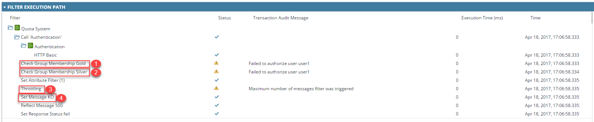

And you can have a look at the corresponding traces :
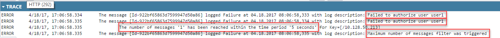

- Go to the "Events" tab
The "Transaction" tab lists the filters for which the result has led to an exception. The "Check Group Membership" and "Throttling" exceptions following the tests with the "user1" user are clearly visible:
 
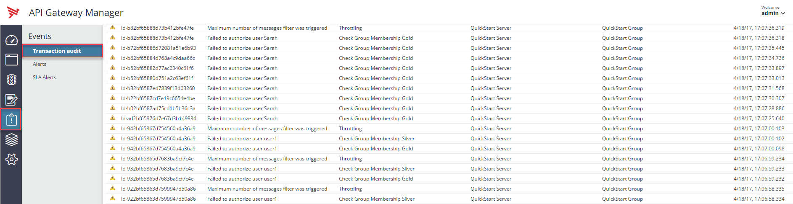

Congratulations, you finished the Quota System policy! A different throttling will be applied depending in which group a ser belongs to.