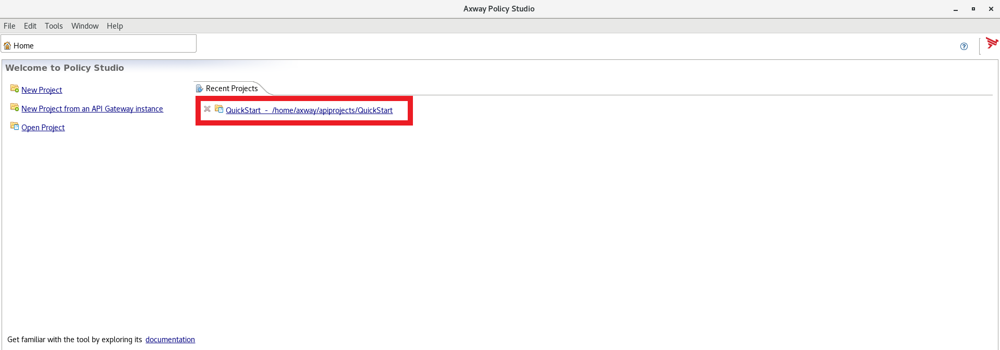
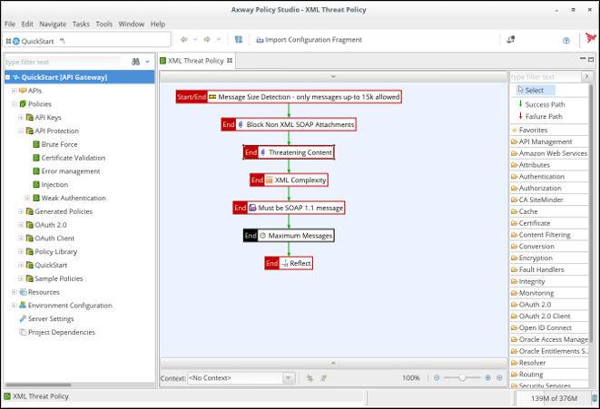
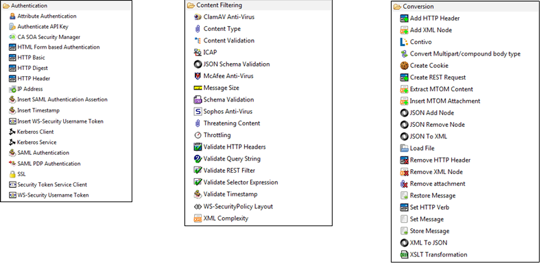
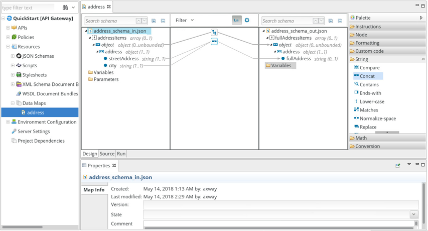

Policy Studio is an Eclipse-based IDE, used to create Policy object. Policies will handle all your needs in Identity mediation, Threat protection and integration.

Open Policy Studio and select QuickStart project :

*When asking passphrase, leave blank and press OK*

Here is an example of typical use of policies you can find :
- Threat protection (DOS/DDOS, Injection, XML Bomb, ...)
- REST to SOAP transformation
- API orchestration/mashup/aggregation
- OAuth 2.0/OpendID Connect client, server and Authorization server. Provided as policy so entirely customizable
- Identity token mediation (ex: OAuth 2.0/SAML)  

As an example, here is a XML threat protection policy.

In the left panel, all policies and parameters organized in containers (or folders)
In the center, XML Threat Policy opened and as you can see, a Policy is a graph of steps, called Filters. 
In the right panel, a set of Filters you can drag and drop on Filter into a Policy. 
**With more than 200 filters, it is capable of a lot of things!**

Here is the content under some filter menus:

Some examples of technical capabilities:
- Protection: API Firewalling, Throttling, size, XML complexity, ...
- Protocol: HTTP(S), JMS, SFTP/FTP(S), pop3, file scanning, scheduler, ...
- Connector: LDAP, JDBC, ICAP, SMTP, Syslog, CA SiteMinder, Oracle Access Manager, ...
- Data manipulation: XML and JSON path manipulation and schema validation, visual mapper, ...
- Security protocols: HTTP Basic, API Key, OAuth 2.0, Open ID Connect, SAML, WS-Security, STS, Kerberos, ...
- Other: cache, key property store, embedded queuer, ... 

It also includes a visual mapper if you need to map data from a format to another :

**Next:** [Let's prepare our environment](../Preparation)
