## Throttling

At the end of this section, you will have a throttling policy limiting one single request every 5 seconds per consumer.
This is our target:
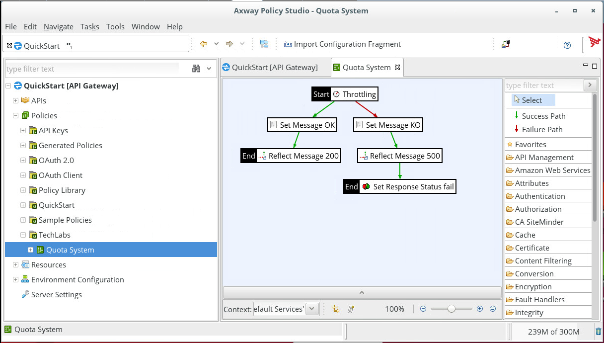

When you test:
- if quota is respected, response is **"Access to service authorized"**. 
- if quota rights are exceeded, response is **"Access to service denied"**.

### Implementation of the **"Quota System"** policy

In the tree view on the left of the screen,
- Expand **"Policies"**
- If **TechLabs** container doesn't exist, right click on **"Policies"** and click **"Add Container"**
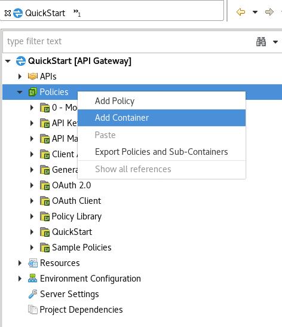

- Write "TechLabs" then click OK
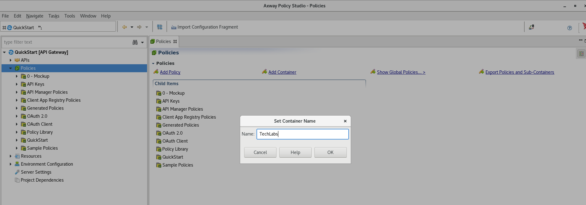

- Right-click on the **"TechLabs"** container and select **"Add Policy"**

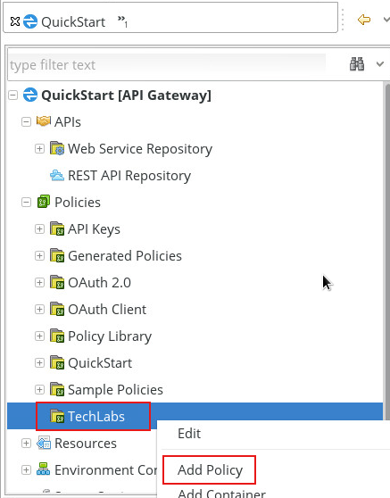

In the window which appears,
- For the **"Name"** field, enter **"Quota System"**
- Click **"OK"**.

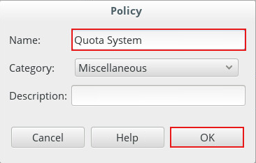

Core of this quota limitation, is detecting if limit of use per unit of time is reached. This is the purpose of  **"Throttling"** filter.
To get it quickly, let use the search zone, located at the top of the right-hand column, and enter **"thro"**
The **"Throttling"** filter appears in the **"Content Filtering"** section 
- Drag and drop this filter to the main frame

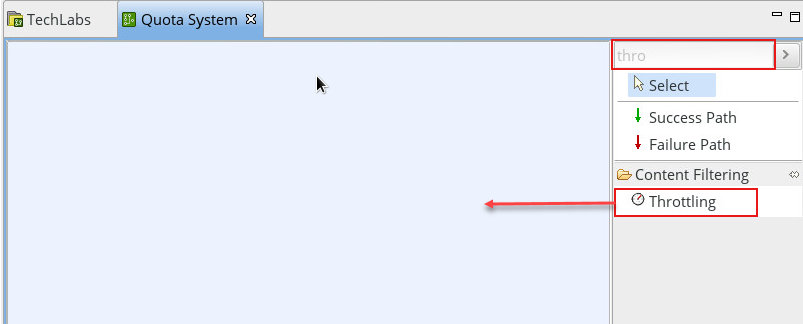

The default configuration for this filter authorizes processing one message every second. 
We will configure the filter to accept the processing of one message every 5 seconds.
- Replace the value 1 in the **"every"** zone with the value **"5"** 

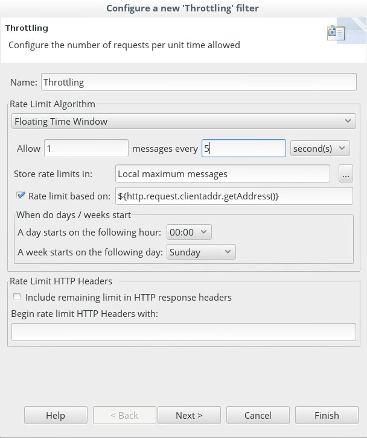
 
- Click **"Finish"**.

- Let's define this step as the first of our policy. Right-click on the **"Throttling"** filter and select **"Set as Start"**.

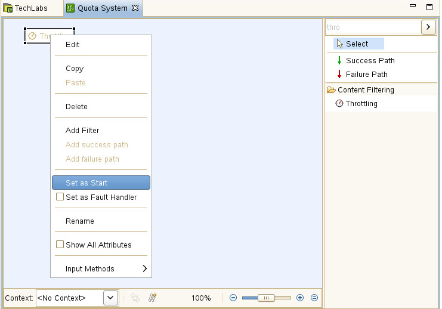


You should have the following:

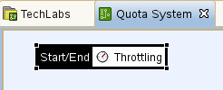
 

Now that the **"Throttling"** filter is in place, we will set the result of the request based on the current quota. 
To do this, we will use the **"Set Message"** and **"Reflect Message"** filters.
- The **"Set Message"** filter is used to initialize the format and the content of a message.
- The **"Reflect Message"** filter is used to return the message of the request. 

We will now set the content of the message in the eventuality that the quota is not reached
- Start entering **"Set Message"** in the search zone at the top-right hand corner.
- Select the **"Set Message"** filter 
- Drag and drop this filter to the **"Throttling"** filter.
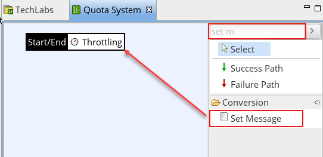

In the **"Configure a new 'Set Message' filter"** window,
- For the **"Name"** field, enter **"Set Message OK"**
- For the **"Content-Type"** field, enter **"text/html"**
- For the **"Message Body"** field, enter
```
<html>
<body>
Access to service authorized
</body>
</html>
```
- Click on the **"Finish"** button

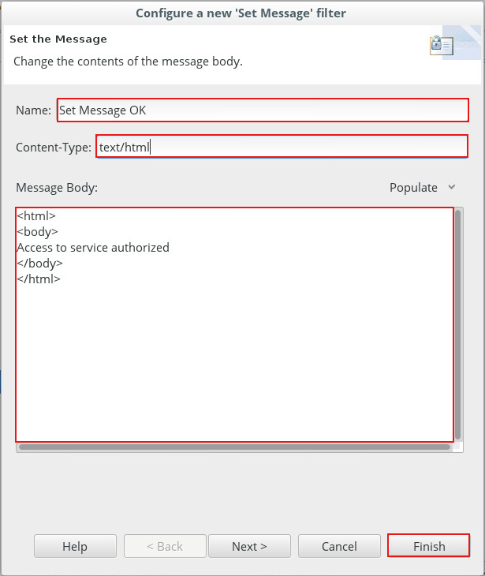

- Create a success path between Throttling and Set Message filtes.
Select **Success Path** into Filers panel then, in the Policy, click on **Throttling** first and next on **Set message OK**.
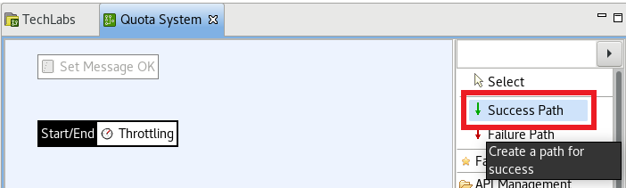

- Start entering **"Reflect Message"** in the search zone in the top-right.
Select the **"Reflect Message"** filter.
- Drag and drop this filter to the **"Set Message OK"** filter.

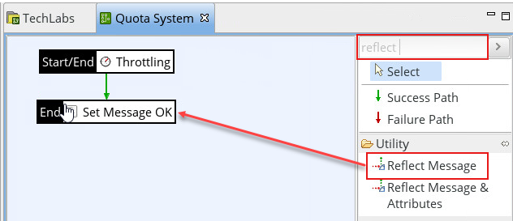
 
In the **"Configure a new 'Reflect Message' filter"** window, 
- For the **"Name"** field, add **"Reflect Message 200"**
- For the **"HTTP response code status"** field, enter **"200"**
- Click on the **"Finish"** button

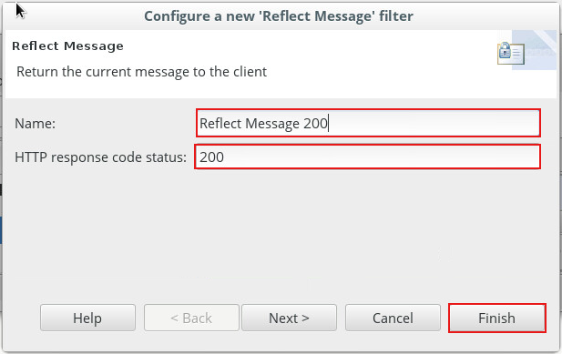

- Select **Success Path** filter to link **"Set Message OK"** to **"Reflect Message 200"**.

We will now put in place the processing of an error message informing that the quota has been reached.
- Start entering **"Set Message"** in the search zone in the top-right.
- Select the **"Set Message"** filter 
- Drag and drop this filter on top of the **"Throttling"** filter.
As the **"Throttling"** filter already has a success path (green arrow), adding another filter will create a failure path (a red arrow).

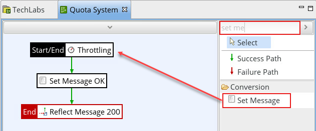

In the **"Configure a new 'Set Message' filter"** window,
- For the **"Name"** field, enter **"Set Message KO"**
- For the **"Content-Type"** field, enter **"text/html"**
- For the **"Message Body"** field, enter 
```
<html>
<body>
Access to service denied
</body>
</html>
```
- Click on the **"Finish"** button

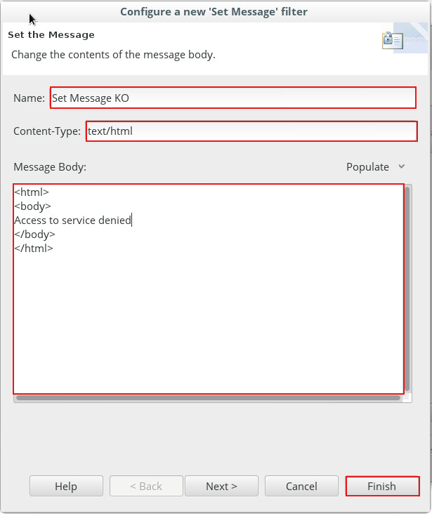

- Create a failure path between Throttling and Set Message KO filtes.
Select **Failure Path** into Filers panel then, in the Policy, click on **Throttling** first and next on **Set message KO**.
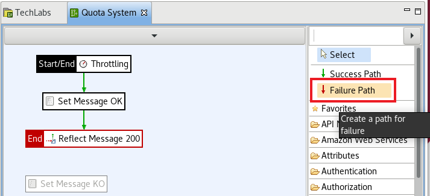


- Start entering **"Reflect Message"** in the search zone in the top-right.
Select the **"Reflect Message"** filter.

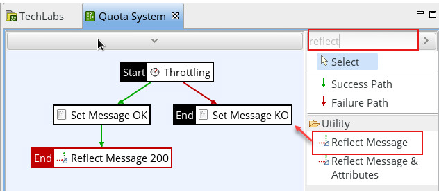

Drag and drop this filter on top of the **"Set Message KO"** filter.


- In the **"Configure a new 'Reflect Message' filter"** window, 
- In the **"Name"** field, enter **"Reflect Message 500"**
- In the **"HTTP response code status"** field, enter **"500"** 
- Click on the **"Finish"** button

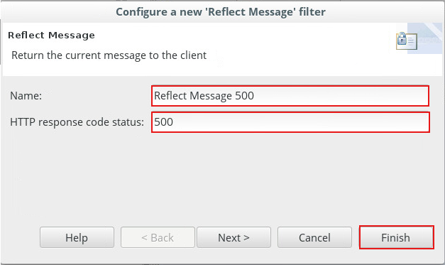

- Select **Success Path** filter to link **"Set Message KO"** to **"Reflect Message 500"**.

The **"Set Response Status"** filter is used to explicitly add a message in the Monitoring displays. 
If this policy proceeds correctly, it will by default be considered positive (whether or not the quota is reached).
However, if the quota is reached, the result of the policy must be an error situation in order to be highlighted in the Monitoring displays (logical and non-technical error). 
We will therefore use the **"Set Response Status"** filter, to raise this error result, when the **"Throttling"** filter detects that the quota has been reached.
- Start entering the policy name **"Set Response Status"** in the search zone in the top-right.
- Select the **"Set Response Status"** filter 
- Drag and drop this filter on top of the **"Reflect Message 500"** filter.

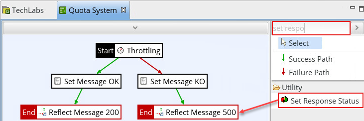


- In the **"Configure a new 'Set Response Status' filter"** window, 
- For the **"Name"** field, enter **"Set Response Status fail"**
- For the **"Response Status"** field, select the **"Fail"** radio button
- Click on the **"Finish"** button
 
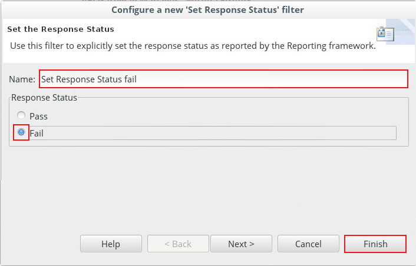


You obtain the following result:
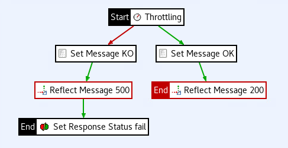


###	Defining the listener

Our first policy is done. Now is the time to test it. Let's make it callable by HTTP. 

It can be done by a shortcut to the default HTTP listener (called "Default Services").
Click the **"Add relative path"** icon at bottom of the screen: 
- For the **"When a request arrives that matches the path"** field, enter **"/TechLabs/quota"**
- Then click OK

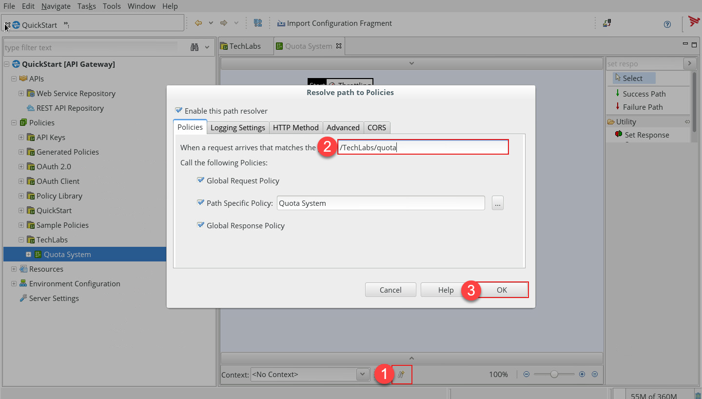

**"Note:"** the created relative path can be seen in the **"Default Services"** listener. Path resolver are managed from this menu. 
**"Environment:"** Do not worry if you do not have the same paths listed. For our scenario only **"/TechLabs/quota"** matters.

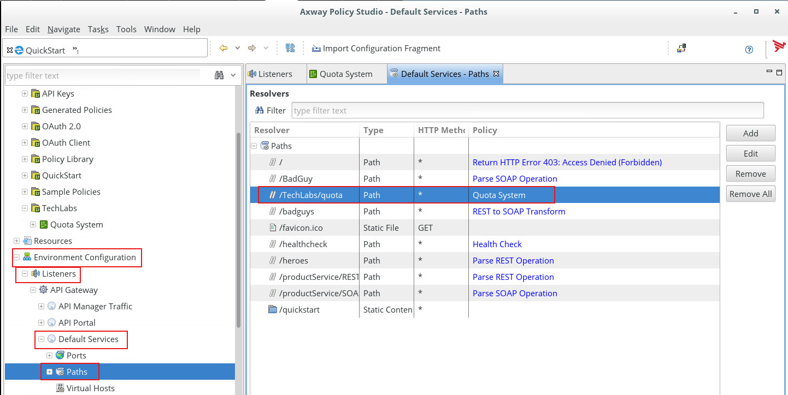


###	Deployment

Policy configuration requires deployment to server to be active  
To do this, you have two possibilities:
- Press **"F6"**.
or
- Click on the deployment icon at the top-right hand corner of the **"Axway Policy Studio"** window
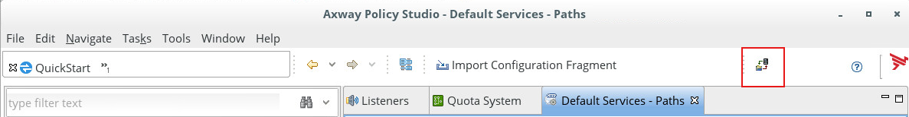

The window **"Deploy"** appears. You connect to the system by identifying yourself:
**"Environment:"** please use the right deployment host and port
- Enter **"changeme"** in the field ****"Password"****
- Click **"Next"**

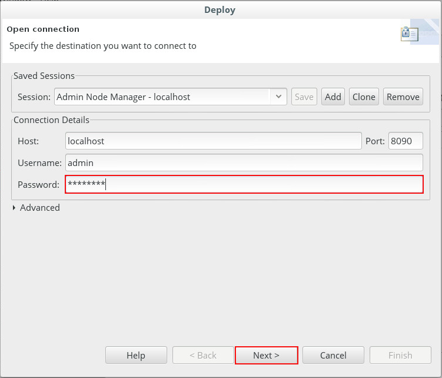


- In the field **"Group"**, select the only group defined
- Click **"Next"**

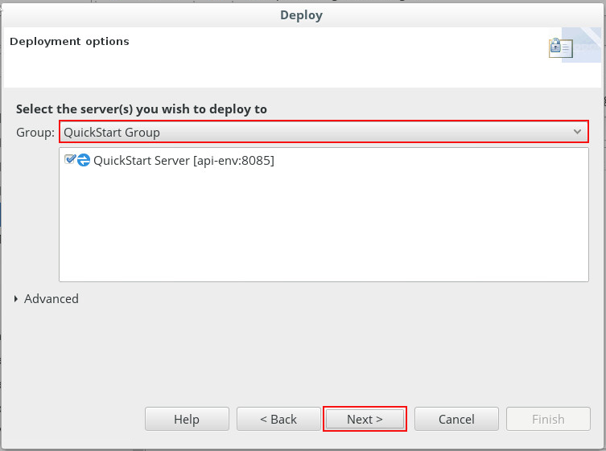

**"Environment:"** Do not worry if you have multiple instances, keep them all.

- Once the configuration has been deployed, click **"Finish"**

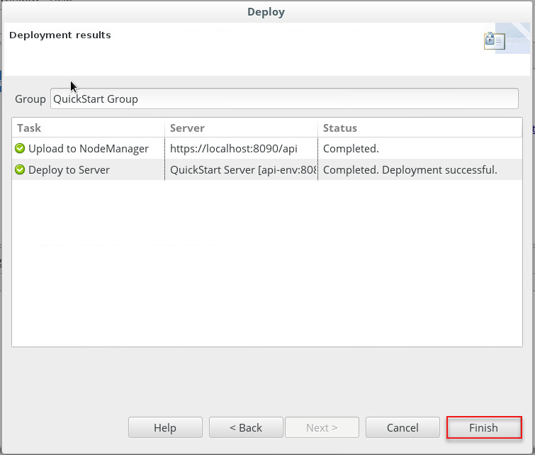


### Tests
- To proceed with the tests, use a web browser. 
- In the browser, enter the URL: **[Default Service url]**/TechLabs/quota
For example, if **[Default Service url]** is http://localhost:8080, use http://localhost:8080/TechLabs/quota

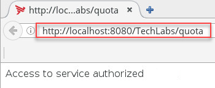

- Click several times on the refresh button to simulate successive requests. 

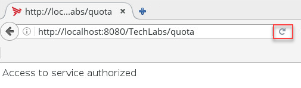


**Expected result**: On the first request, the service returns a positive response. The request submitted has been accepted by the **"Throttling"** filter.
If the number of requests is less than one every 5 seconds, the responses returned will be **"Access to service authorized"** (Access to service authorized).
If the number of requests is greater than one every 5 seconds, the responses will be negative: **"Access to service denied"** (Access to service denied).

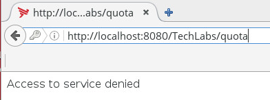


###	The API Gateway Manager
The API Gateway Manager is the web console for the administration of the Axway solution. It includes monitoring capabilitieswe will use right now.
- In the browser, please use **API Gateway Manager** shortcut : 
 
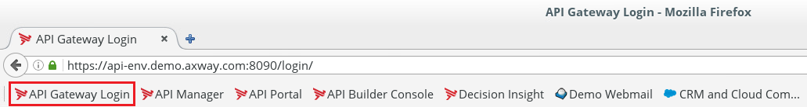

- If authentication is asked, 
Enter **"admin"** in the field **"Username"** 
Enter **"changeme"** in the field **"Password 
 
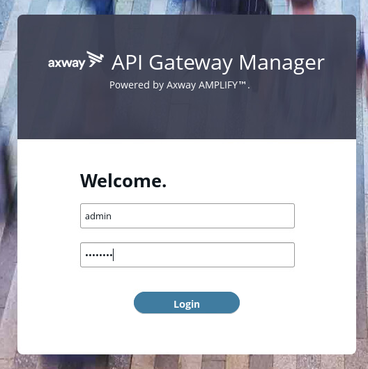


#### Dashboard
The **"Dashboard"** tab displays:
- The statistics for traffic on the platform.
- The deployment topology for nodes, instances and their associated states.
- The top 5 most-used services on the server.
The **"Dashboard"** tab displays the total number of messages processed by the API Gateway platform. 
**Environment**: healthcheck is regularly called in a kubernetes environment. This affects traffic count. Transactions are hidden in Traffic Monitor for readability.
You calls to **"Quota System"** ar ealso included policy:

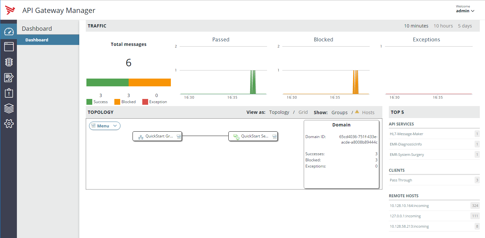

The positive responses are listed in **"Messages passed"** and the negative ones indicated in **"Messages Failed"**.

#### Monitoring
The **"Monitoring"** tab offers:
- A real-time view of the statistics of the API Gateway server activity.
- These statistics are grouped into categories: System / API Services / API Methods/ Clients / Remote Hosts.

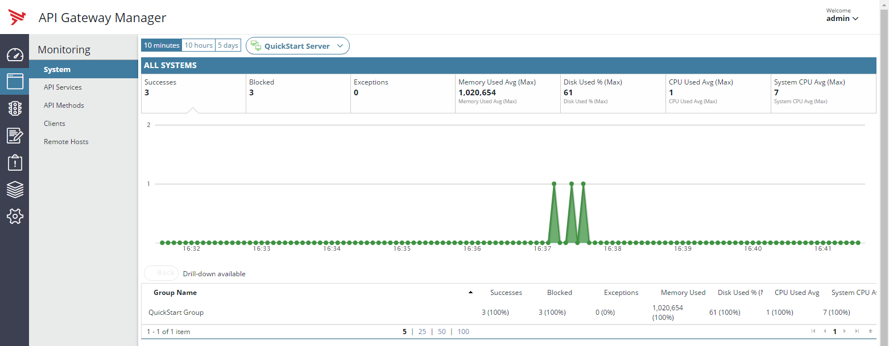

#### Traffic
The **"Traffic"** tab is an interface dedicated to developers and administrators in order to view the details of a specific request. 
In the **"Traffic"** tab, it is possible to identify the requests which have been accepted (Status: 200 OK) and those which have been rejected (Status: 500 Internal Server Error)

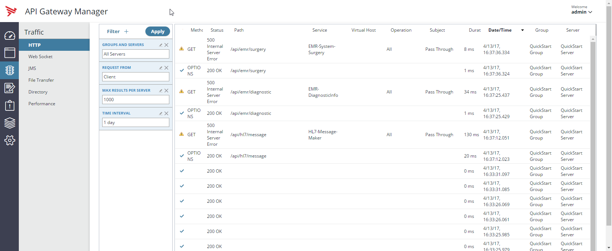

**Next:** [Let's add authentication mechanism](../Authentication_based_quota_policy)
